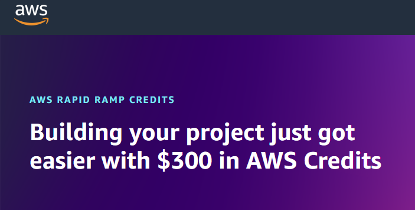

# How I Got $300 FREE AWS Credits

<figure markdown="span">
  { width="600" }
  <figcaption>How I Got $300 FREE AWS Credits3</figcaption>
</figure>

<figure markdown="1">
{ width="30" }
<figcaption><strong>Opeyemi Okuboyejo</strong></figcaption>
</figure>

<!-- more -->

??? youtube "Video - Watch this YouTube Video Where I explained How I Got $300 FREE AWS Credits"
    <iframe width="560" height="315" src="https://www.youtube-nocookie.com/embed/NY7DHvo1XVM?si=KfN1qCMItT-M3QCE" title="YouTube video player" frameborder="0" allow="accelerometer; autoplay; clipboard-write; encrypted-media; gyroscope; picture-in-picture; web-share" referrerpolicy="strict-origin-when-cross-origin" allowfullscreen></iframe>

    In this video I share how I got $300 FREE AWS Credits and how you can also apply for the credits.

Welcome to OpeyemiTechPro Blog for Cloud Engineering and DevOps Stuff

## The Invitation by AWS

__This is the story of how we managed to completely rebuild client-side search,
delivering a significantly better user experience while making it faster and
smaller at the same time.__

---

**How I Got $300 Free AWS Credits and How It has Boosted My Projects**

About six months ago, I applied for $300 in free AWS credits—and it’s been a game-changer for my projects. The process was fairly straightforward. After reading about AWS's promotional credits, I filled out an application on the AWS website, explaining how I planned to use their cloud services for personal projects and learning. A few days later, I received an approval email, and just like that, I had $300 to explore more of AWS.

**What I've Built with AWS Credits**

With these credits, I’ve been able to venture beyond the Free Tier and try out AWS services that would normally come with a cost. Some key ways I’ve used these credits include:
- **Running larger EC2 instances** for high-performance compute tasks, which is something I couldn’t do with the free-tier instance types.
- **Storing large datasets on S3**, giving me the flexibility to work with more data than the Free Tier allows.
- **Exploring AWS Lambda and API Gateway**, where I built serverless applications with zero infrastructure management.

The credits have been a great opportunity to test and grow my projects without worrying about unexpected costs.

**Documenting My Journey**

I’m also working on a video that walks through my entire process—from applying for the credits to showcasing the projects I’ve built. If you're curious about leveraging AWS credits yourself, stay tuned for my video where I’ll share tips and lessons learned along the way!

If you have questions about the process or how to make the most out of AWS credits, feel free to reach out!

---

