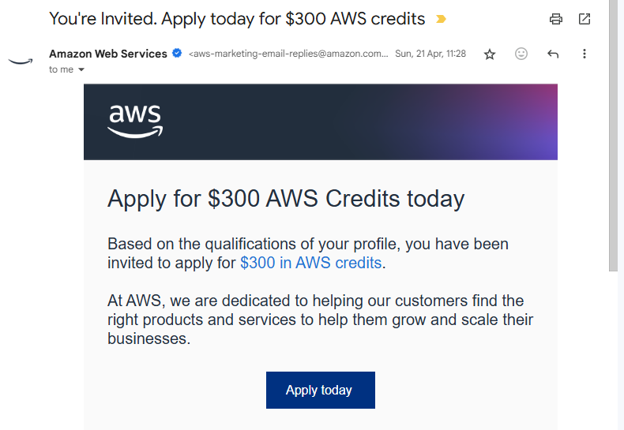
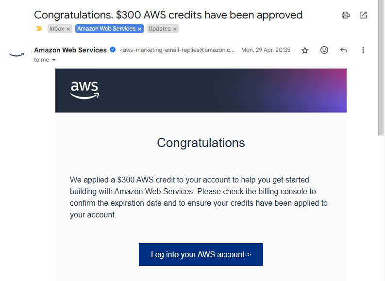

# **How I Got $300 FREE AWS Credits**

<figure markdown="span">
  
  <figcaption>How I Got $300 FREE AWS Credits</figcaption>
</figure>

__Six months ago, I applied for $300 in free AWS credits, and it’s been a game-changer for my cloud projects. With these credits, I’ve gone beyond the Free Tier plan, provisioning multiple larger EC2 instances and leaving them running for days, experimenting with various kubernetes deployments, and trying out IaC configurations. It has opened up so many possibilities without worrying about costs. In this shot blog post, I share the process of approval and some other relevant resouces and give tips for getting and using AWS credits!__
<!-- more -->

??? youtube "Video - Watch this YouTube Video Where I explained How I Got $300 FREE AWS Credits"
    <iframe width="560" height="315" src="https://www.youtube-nocookie.com/embed/NY7DHvo1XVM?si=KfN1qCMItT-M3QCE" title="YouTube video player" frameborder="0" allow="accelerometer; autoplay; clipboard-write; encrypted-media; gyroscope; picture-in-picture; web-share" referrerpolicy="strict-origin-when-cross-origin" allowfullscreen></iframe>

    In this video I share how I got $300 FREE AWS Credits and how you can also apply for the credits.

---

## **The Invitation by AWS**

Earlier this year, I got an email from AWS inviting me to apply for __The AWS Rapid Ramp Credit Program__ which provides a $300 credit to small businesses to quickly get started testing AWS against their specific IT and business requirements by subsidizing a proof of concept.  The free AWS credits would be applied to my AWS account. 

This was trillig as my AWS account was relatively new (barely 1-month old). 

The process was fairly straightforward. I followed the link in the email and I filled out an application on the AWS website, explaining how I planned to use their cloud services for personal projects and learning. A week later, I received an approval email, and just like that, I had $300 to explore more of AWS.

I later discovered that though I was invited to apply for the credits, anyone could easily apply for the free $300 credits as long as you meet some basic requirements.

**To qualify for the $300 AWS Rapid Ramp Credit Program, you must have:**
1. A valid AWS account, with up-to-date billing information (reseller accounts do not qualify)
2. Not previously received more than $300 of AWS promotional credit
3. A sufficient business case and proof of concept to test using the credits
4. No linked accounts

## **How To Apply For the AWS $300 Credits**

Applying for AWS credits is simple. Start by visiting the AWS Promotional Credits page (link below), where you’ll find the application form. You’ll need to provide basic details about your AWS account, your project description and intent explaining how you plan to use AWS services. Be clear about your goals and the value AWS will bring to your project. Once submitted, AWS typically reviews your request within a few days. If approved, you’ll receive an email notification saying te credits have been applied to your account and you can view your credits from your __AWS Billing and Cost Mangement Console.__

[**Click Here to apply for the $300 AWS Rapid Ramp Credit Program**](https://pages.awscloud.com/GLOBAL_NCA_LN_ARRC-program-A300-2023.html)

## **What Services Does the AWS Credits Cover?**

The $300 credits cover more than 230 AWS services including compute, Lambda serverless, storage, Bedrock, Sagemaker, EKS, ECR, etc 

With these credits, I’ve been able to venture beyond the AWS Free Tier and try out AWS services that would normally come with a cost.

The credits have been a great opportunity to test and grow my projects without worrying about unexpected costs.

## **Additional Resources**

Below are some additional resources that talk more about AWS credits:

1. [Unlocking AWS Credits: A Comprehensive Guide - AWS Community](https://community.aws/content/2aEQy4l7lCyRaFSO3jlThfw6Voi/unlocking-aws-credits-a-comprehensive-guide-to-maximize-cloud-savings-and-resources?lang=en)
2. [Applying AWS Credits- AWS Documentation Website](https://docs.aws.amazon.com/awsaccountbilling/latest/aboutv2/useconsolidatedbilling-credits.html#selecting-credits-to-apply)

---