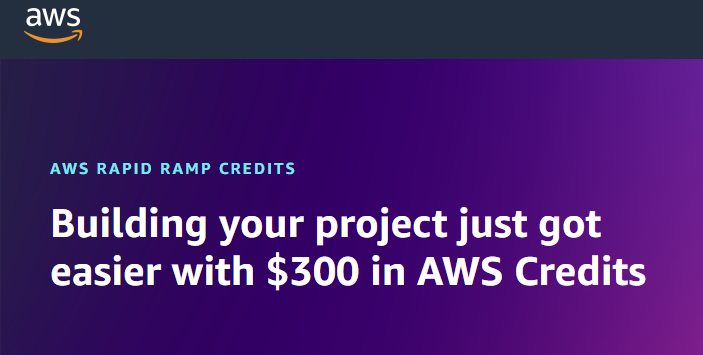

# **How I Got $300 FREE AWS Credits**

<figure markdown="span">
  
  <figcaption>How I Got $300 FREE AWS Credits</figcaption>
</figure>

__Six months ago, I applied for $300 in free AWS credits, and it’s been a game-changer for my cloud projects. With these credits, I’ve gone beyond the Free Tier plan, provisioning multiple larger EC2 instances and leaving them running for days :smile:,  experimenting with various kubernetes deployments, and trying out IaC configurations. It has opened up so many possibilities without worrying about costs. In this shot blog post, I share the process of approval and some other relevant resouces and give tips for getting and using AWS credits!__
<!-- more -->

??? youtube "Video - Watch this YouTube Video Where I explained How I Got $300 FREE AWS Credits"
    <iframe width="560" height="315" src="https://www.youtube-nocookie.com/embed/NY7DHvo1XVM?si=KfN1qCMItT-M3QCE" title="YouTube video player" frameborder="0" allow="accelerometer; autoplay; clipboard-write; encrypted-media; gyroscope; picture-in-picture; web-share" referrerpolicy="strict-origin-when-cross-origin" allowfullscreen></iframe>

    In this video I share how I got $300 FREE AWS Credits and how you can also apply for the credits.

---

## **The Invitation by AWS**

Earlier this year, I got an email from AWS inviting me to apply for __The AWS Rapid Ramp Credit Program__ which provides a $300 credit to small businesses to quickly get started testing AWS against their specific IT and business requirements by subsidizing a proof of concept.  The free AWS credits would be applied to my AWS account. 

This was trillig as my AWS account was relatively new (barely 1-month old). 

The process was fairly straightforward. I followed the link in the email and I filled out an application on the AWS website, explaining how I planned to use their cloud services for personal projects and learning. A week later, I received an approval email, and just like that, I had $300 to explore more of AWS.

I later discovered that though I was invited to apply for the credits, anyone could easily apply for the free $300 credits as long as you meet some basic requirements.

**To qualify for the $300 AWS Rapid Ramp Credit Program, you must have:**
1. A valid AWS account, with up-to-date billing information (reseller accounts do not qualify)
2. Not previously received more than $300 of AWS promotional credit
3. A sufficient business case and proof of concept to test using the credits
4. No linked accounts

## **How To Apply For the AWS $300 Credits**

Applying for AWS credits is simple. Start by visiting the AWS Promotional Credits page (link below), where you’ll find the application form. You’ll need to provide basic details about your AWS account, your project description and intent explaining how you plan to use AWS services. Be clear about your goals and the value AWS will bring to your project. Once submitted, AWS typically reviews your request within a few days. If approved, you’ll receive an email notification saying te credits have been applied to your account and you can view your credits from your __AWS Billing and Cost Mangement Console.__

<!-- [**Click Here to apply for the $300 AWS Rapid Ramp Credit Program**](https://pages.awscloud.com/GLOBAL_NCA_LN_ARRC-program-A300-2023.html) -->
<a href="https://pages.awscloud.com/GLOBAL_NCA_LN_ARRC-program-A300-2023.html" target="_blank"><strong>Click Here to apply for the $300 AWS Rapid Ramp Credit Program</strong></a>
<!-- 
 -->

## **What Services Does the AWS Credits Cover?**

The $300 credits cover **more than 230 AWS services** including Compute, Lambda serverless, storage, Bedrock, Sagemaker, EKS, ECR, and the list goes on :smile:. 

!!! info Click here to view the list of services covered by the AWS Credits
    
    *__Note:__* _This list may changed subject to AWS Terms and Conditions_

    Complete list of services

    These services can be used with the associated credit:

    1. AWS Amplify
    2. AWS App Runner
    3. AWS AppFabric
    4. AWS AppSync
    5. AWS Application Migration Service
    6. AWS Audit Manager
    7. AWS B2B Data Interchange
    8. AWS Backup
    9. AWS Billing Conductor
    10. AWS Budgets
    11. AWS Certificate Manager
    12. AWS Clean Rooms
    13. AWS Cloud Map
    14. AWS Cloud WAN
    15. AWS CloudFormation
    16. AWS CloudHSM
    17. AWS CloudTrail
    18. AWS CodeArtifact
    19. AWS CodeCommit
    20. AWS CodeDeploy
    21. AWS CodePipeline
    22. AWS Compute Optimizer
    23. AWS Config
    24. AWS Cost Explorer
    25. AWS Data Exchange
    26. AWS Data Pipeline
    27. AWS Data Transfer
    28. AWS DataSync
    29. AWS Database Migration Service
    30. AWS DeepRacer
    31. AWS Device Farm
    32. AWS Direct Connect
    33. AWS Directory Service
    34. AWS Elastic Disaster Recovery
    35. AWS Elemental MediaConnect
    36. AWS Elemental MediaConvert
    37. AWS Elemental MediaLive
    38. AWS Elemental MediaPackage
    39. AWS Elemental MediaStore
    40. AWS Elemental MediaTailor
    41. AWS End User Messaging Third Party Fees
    42. AWS Entity Resolution
    43. AWS Fault Injection Simulator
    44. AWS Firewall Manager
    45. AWS Global Accelerator
    46. AWS Glue
    47. AWS Glue Elastic Views
    48. AWS Greengrass
    49. AWS Ground Station
    50. AWS HealthImaging
    51. AWS Identity and Access Management Access Analyzer
    52. AWS Import/Export
    53. AWS Import/Export Snowball
    54. AWS IoT
    55. AWS IoT 1 Click
    56. AWS IoT Analytics
    57. AWS IoT Device Defender
    58. AWS IoT Device Management
    59. AWS IoT Events
    60. AWS IoT FleetWise
    61. AWS IoT SiteWise
    62. AWS IoT Things Graph
    63. AWS IoT TwinMaker
    64. AWS Key Management Service
    65. AWS Lake Formation
    66. AWS Lambda
    67. AWS Mainframe Modernization
    68. AWS Migration Hub Refactor Spaces
    69. AWS Modular Data Center
    70. AWS Network Firewall
    71. AWS OpsWorks
    72. AWS Outposts
    73. AWS Parallel Computing Service
    74. AWS Payment Cryptography
    75. AWS Private 5G
    76. AWS Resilience Hub
    77. AWS RoboMaker
    78. AWS Route 53 Application Recovery Controller
    79. AWS Secrets Manager
    80. AWS Security Hub
    81. AWS Service Catalog
    82. AWS Shield
    83. AWS SimSpace Weaver
    84. AWS Snowball Extra Days
    85. AWS Step Functions
    86. AWS Storage Gateway
    87. AWS Storage Gateway Deep Archive
    88. AWS Supply Chain
    89. AWS Support (Business)
    90. AWS Support (Developer)
    91. AWS Systems Manager
    92. AWS Telco Network Builder
    93. AWS Transfer Family
    94. AWS WAF
    95. AWS Wickr
    96. AWS X-Ray
    97. AWS re:Post Private
    98. Alexa Top Sites
    99. Alexa Web Information Service
    100. Alexa for Business
    101. Amazon API Gateway
    102. Amazon AppFlow
    103. Amazon AppStream
    104. Amazon Athena
    105. Amazon Augmented AI
    106. Amazon Bedrock
    107. Amazon Braket
    108. Amazon Chime
    109. Amazon Chime Business Calling a service sold by AMCS LLC
    110. Amazon Chime Call Me
    111. Amazon Chime Call Me a service sold by AMCS LLC
    112. Amazon Chime Dial In a service sold by AMCS LLC
    113. Amazon Chime Dialin
    114. Amazon Chime Features
    115. Amazon Chime Services
    116. Amazon Chime Voice Connector a service sold by AMCS LLC
    117. Amazon Cloud Directory
    118. Amazon CloudFront
    119. Amazon CloudSearch
    120. Amazon CodeWhisperer
    121. Amazon Cognito
    122. Amazon Cognito Sync
    123. Amazon Comprehend
    124. Amazon Connect
    125. Amazon Connect Customer Profiles
    126. Amazon Connect Voice ID
    127. Amazon DataZone
    128. Amazon Deadline Cloud
    129. Amazon Detective
    130. Amazon DevOps Guru
    131. Amazon DocumentDB (with MongoDB compatibility)
    132. Amazon DynamoDB
    133. Amazon EC2 Container Registry (ECR)
    134. Amazon EKS Anywhere
    135. Amazon ElastiCache
    136. Amazon Elastic Compute Cloud
    137. Amazon Elastic Container Registry Public
    138. Amazon Elastic Container Service
    139. Amazon Elastic Container Service for Kubernetes
    140. Amazon Elastic File System
    141. Amazon Elastic Inference
    142. Amazon Elastic MapReduce
    143. Amazon Elastic Transcoder
    144. Amazon FSx
    145. Amazon FinSpace
    146. Amazon Forecast
    147. Amazon Fraud Detector
    148. Amazon GameLift
    149. Amazon Glacier
    150. Amazon GuardDuty
    151. Amazon HealthLake
    152. Amazon Honeycode
    153. Amazon IVS Chat
    154. Amazon Inspector
    155. Amazon Inspector
    156. Amazon Interactive Video Service
    157. Amazon Kendra
    158. Amazon Keyspaces (for Apache Cassandra)
    159. Amazon Kinesis
    160. Amazon Kinesis Analytics
    161. Amazon Kinesis Firehose
    162. Amazon Kinesis Video Streams
    163. Amazon Lex
    164. Amazon Lightsail
    165. Amazon Location Service
    166. Amazon Lookout for Equipment
    167. Amazon Lookout for Metrics
    168. Amazon Lookout for Vision
    169. Amazon MQ
    170. Amazon Machine Learning
    171. Amazon Macie
    172. Amazon Managed Blockchain
    173. Amazon Managed Grafana
    174. Amazon Managed Service for Prometheus
    175. Amazon Managed Streaming for Apache Kafka
    176. Amazon Managed Workflows for Apache Airflow
    177. Amazon MemoryDB
    178. Amazon Mobile Analytics
    179. Amazon Monitron
    180. Amazon Neptune
    181. Amazon Nimble Studio
    182. Amazon Omics
    183. Amazon OpenSearch Service
    184. Amazon Personalize
    185. Amazon Pinpoint
    186. Amazon Polly
    187. Amazon Q
    188. Amazon Quantum Ledger Database
    189. Amazon QuickSight
    190. Amazon Redshift
    191. Amazon Rekognition
    192. Amazon Relational Database Service
    193. Amazon Route 53
    194. Amazon S3 Glacier Deep Archive
    195. Amazon SageMaker
    196. Amazon Security Lake
    197. Amazon Simple Email Service
    198. Amazon Simple Notification Service
    199. Amazon Simple Queue Service
    200. Amazon Simple Storage Service
    201. Amazon Simple Workflow Service
    202. Amazon SimpleDB
    203. Amazon Sumerian
    204. Amazon Textract
    205. Amazon Timestream
    206. Amazon Transcribe
    207. Amazon Translate
    208. Amazon Verified Permissions
    209. Amazon Virtual Private Cloud
    210. Amazon WorkDocs
    211. Amazon WorkLink
    212. Amazon WorkSpaces
    213. Amazon WorkSpaces Application Manager
    214. Amazon WorkSpaces Thin Client
    215. Amazon WorkSpaces Web
    216. AmazonCloudWatch
    217. AmazonConnectCases
    218. AmazonWorkMail
    219. CloudWatch Events
    220. CodeBuild
    221. CodeCatalyst
    222. CodeGuru
    223. Comprehend Medical
    224. Contact Center Telecommunications (service sold by AMCS, LLC)
    225. Contact Center Telecommunications Korea
    226. Contact Center Telecommunications South Africa
    227. Contact Lens for Amazon Connect
    228. DynamoDB Accelerator (DAX)
    229. Elastic Load Balancing
    230. Q in Connect
    231. VMware Cloud on AWS

<a href="../../assets/files/List_of_AWS_Credit_services.txt" target="_blank">View List of Services covered by the AWS Credits</a>

With these credits, I’ve been able to venture beyond the AWS Free Tier and try out AWS services that would normally come with a cost.

The credits have been a great opportunity to test and grow my projects without worrying about unexpected costs.

## **Additional Resources**

Below are some additional resources that talk more about AWS credits:

1. <a href="https://community.aws/content/2aEQy4l7lCyRaFSO3jlThfw6Voi/unlocking-aws-credits-a-comprehensive-guide-to-maximize-cloud-savings-and-resources?lang=en" target="_blank">Unlocking AWS Credits: A Comprehensive Guide - AWS Community</a>
2. <a href="https://docs.aws.amazon.com/awsaccountbilling/latest/aboutv2/useconsolidatedbilling-credits.html#selecting-credits-to-apply" target="_blank">Applying AWS Credits- AWS Documentation Website</a>

---