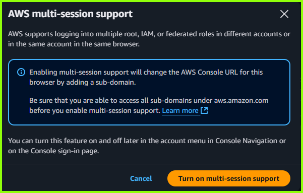
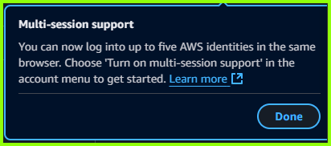

# **Exciting News: AWS Introduces Multi-Session Support in the AWS Management Console!**

<figure markdown="span">
  
  <figcaption>AWS Introduces Multi-Session Support in the AWS Management Console</figcaption>
</figure>

__I am thrilled to share that AWS has rolled out a fantastic new feature in the AWS Management Console — **Multi-Session Support!**__
<!-- more -->

 This innovative addition allows users to sign in to up to five different identities simultaneously within a single web browser. Whether you're managing multiple AWS accounts or juggling various roles within the same account, this feature is designed to streamline your workflow and enhance productivity.

## **Key Highlights:**

1. **Multi-Session Capability**: Sign in to up to five different identities at once. These can be any combination of root, IAM, or federated roles across different accounts or within the same account.
2. **Separate Instances**: Each identity opens its own instance of the AWS Management Console in a new tab, making it easier to manage multiple sessions without confusion.
3. **Easy Opt-In**: To enable multi-session support, simply choose "Turn on multi-session" in the account menu or enable it on the AWS Management Console. Remember, this opt-in is browser-specific, so you'll need to enable it separately for each browser you use.
4. **Seamless Transition**: Once enabled, the console URL will include a subdomain, so be sure to update your bookmarks and console links accordingly.

](https://opeyemitech.pro/my-projects/blog/aws_console_multi-session_support/)

This feature is a game-changer for AWS users who need to manage multiple accounts or roles efficiently. By allowing simultaneous sign-ins, AWS is making it easier than ever to navigate and manage your cloud resources.

Read more from the [AWS Documentation page](https://docs.aws.amazon.com/awsconsolehelpdocs/latest/gsg/multisession.html){: target="_blank" }

---