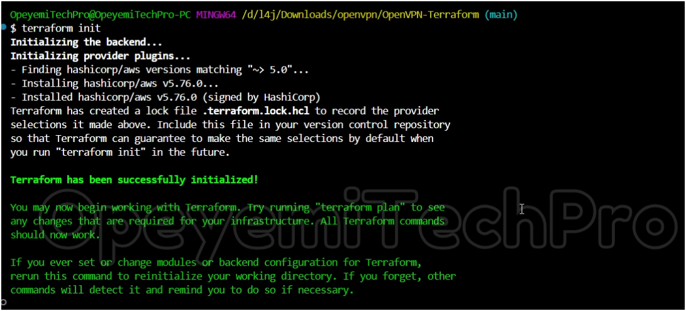
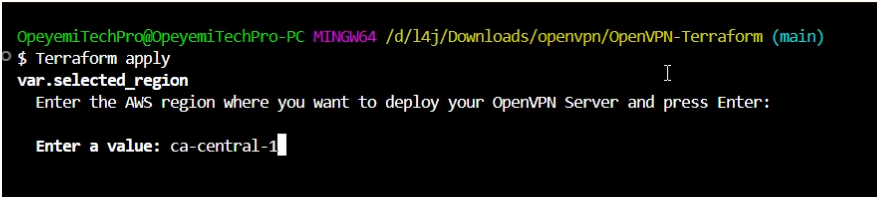
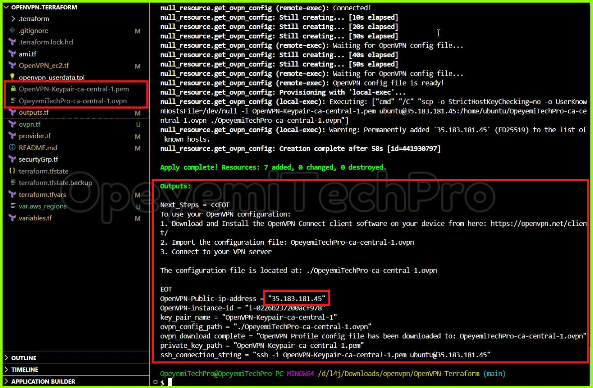
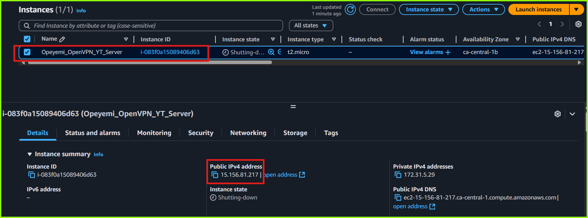
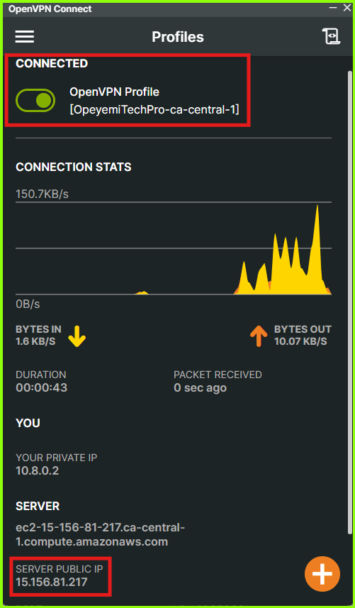
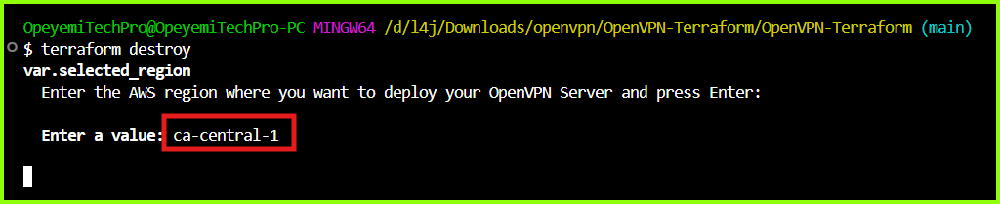

# **End-to_End CI/CD Deployment to Kubernetes**

## **Setup and Host Your Own Free VPN Server on AWS Using Terraform and OpenVPN**

In this mini-project, I will demonstrate how to setup and self-host a VPN server on AWS using terraform and OpenVPN Access Server.

???+ youtube "Watch the Video - How To Create a Free Self-Hosted VPN Server on AWS using Terraform and OpenVPN" 
    <figure markdown="1">
    [](https://youtu.be/sWBeZ_bx2Ps){: target="_blank" }
    <!-- <figcaption>Create a Free Self-Hosted VPN Server on AWS using Terraform and OpenVPN</figcaption>  -->
    </figure>
    /// caption
    How to Create a Free Self-Hosted VPN Server on AWS using Terraform and OpenVPN
    ///


## **Introduction**

Setting up a self-hosted VPN server can be a cost-effective and secure solution for personal or organizational needs. This documentation provides a step-by-step guide on using a Terraform configuration script to deploy an OpenVPN Access server on AWS. 
With this guide, you'll learn how to configure the script, customize it for your requirements, and launch a fully functional VPN server in less than 5-minutes and ensures your internet traffic remains private and encrypted without been locked in a vpn subscription plan.
This VPN server is also "disposable", meaning, you can create and delete it anytime after use with just one command :smile: 

## **Pre-requisites**

- [x] AWS account _([free tier account will work :fontawesome-solid-arrow-up-right-from-square:](https://aws.amazon.com/free/){: target="_blank" })_
- [x] Terraform installed on local machine _([How to Install Terraform :fontawesome-solid-arrow-up-right-from-square:](https://developer.hashicorp.com/terraform/install){: target="_blank" })_
- [x] OpenVPN Connect Client software installed on local machine _(download from [here:fontawesome-solid-arrow-up-right-from-square:](https://openvpn.net/client/){: target="_blank" })_
- [x] Your AWS access key ID and secret access key _(learn how to get your AWS access keys [here :fontawesome-solid-arrow-up-right-from-square:](https://docs.aws.amazon.com/cli/latest/userguide/cli-authentication-user.html){: target="_blank" })_
- [x] AWS CLI installed and configured with your AWS access key ID and Secret access keys _(learn more about AWS CLI [here :fontawesome-solid-arrow-up-right-from-square:](https://docs.aws.amazon.com/cli/latest/userguide/getting-started-quickstart.html){: target="_blank" })_ 
- [x] The OpenVPN-Terraform Setup Script _(click the button below)_

    <div style="text-align: center;">
    [11-Microservices-k8s-App Source Code :simple-github: :fontawesome-solid-arrow-up-right-from-square:](https://github.com/opeyemitechpro/11-Microservices-k8s-App){: target="_blank" .md-button .md-button--primary}
    </div>

:fontawesome-solid-arrow-up-right-from-square: <br>
:fontawesome-solid-up-right-from-square: <br>
:fontawesome-solid-square-arrow-up-right: <br>
:fontawesome-solid-arrow-up-right-from-square: <br>
:fontawesome-solid-arrow-up-right-from-square: <br>
<i class="fa-solid fa-arrow-up-right-from-square"></i>


## *Install Gitleaks**

```
# Download and install the latest release of Gitleaks
curl -sSfL https://raw.githubusercontent.com/gitleaks/gitleaks/master/scripts/install.sh | sudo sh -s -- -b /usr/local/bin
```

```
curl -s https://api.github.com/repos/gitleaks/gitleaks/releases/latest \
| grep "browser_download_url.*linux.*amd64" \
| cut -d '"' -f 4 \
| wget -qi -

tar -xvf gitleaks_*.tar.gz
sudo mv gitleaks /usr/local/bin/
gitleaks version
```


```
GITLEAKS_VERSION=$(curl -s "https://api.github.com/repos/gitleaks/gitleaks/releases/latest" | grep -Po '"tag_name": "v\K[0-9.]+')
wget -qO gitleaks.tar.gz https://github.com/gitleaks/gitleaks/releases/latest/download/gitleaks_${GITLEAKS_VERSION}_linux_x64.tar.gz
sudo tar xf gitleaks.tar.gz -C /usr/local/bin gitleaks
# gitleaks version
rm -rf gitleaks.tar.gz
```

## **Worklflow**

- [x] Run Terraform to setup Jenkins
- [x] Confiure Jenkins
    - [x]  install plugins
        - SonarQube Scanner
        - docker
        - docker pipeline
        - docker build step
        - cloudbees docker build and publish
        - kubernetes
        - kubernetes CLI
        - Email Extension Template
        - Prometheus Metrics
        - OWASP Dependency Check Plugin

## **Configure Plugins**

### **SonarQube**

- [x] Server Name: sonar
(Or use a suitable name)

- [x] Server URL: `<sonar_server_ip:9000>`

!!! tip "Tip"
    
    Since our SonarQube server is running as a docker container on port `9000` on the same machine as the Jenkins server, use `http://<server_ip_address:9000>` as the Server URL


### **Prometheus**
- [x] No further configuration needed
- [x] By default, the Prometheus metrics will be scrapped from `http://<jenkins_server_ip:8080>/prometheus`

### **Docker Hub Credentials**

- [x] Configure Docker Credentials to enable pushing docker images to Docker Hub

### **Jenkins Email Notifications**

Goto `Dashboard > Manage Jenkins > System` and configure both the __"Extended E-mail Notification"__ and the __"E-mail Notification"__ sections as below:

- [x] SMTP Server Name: smtp.gmail.com
- [x] SMTP Port:  465
- [x] Username:    `user_email_id@gmail.com`
- [x] Password: `app_password`
- [x] Use SSL: checked
- [x] System Admin e-mail address: `<Admin_Name> <user_email_id@gmail.com>`
- [x] Default Content Type: `HTML`
- [x] Test email delivery


!!! note "Note"

    - The settings above apply to Gmail address configuration. Confirm SMTP settings from your email service provider.
    - Copy `App password` from your gmail account security settings and use that as the password in the above configuration.


## **What this Terraform Configuration Script Does**

This terraform configuration creates a fully functional, free and ready-to-use self-hosted OpenVPN Server in any chosen AWS region. The script perfomes the following operations:

- Creates a Ubuntu 22.04 EC2 instance and configures a fully functional OpenVPN Access Server on it
- Configures the server as a type t2-micro instance so that it can run within the AWS Free-tier plan (Learn more about the AWS free-tier plan [here](https://aws.amazon.com/free){: target="_blank" })
- Sets up and configures the VPN server with an IP address in the speicified AWS region.
- Generates an AWS keypair file for optional SSH connection to the EC2 instance, downloads the file and saves it in the terraform working directory on your local machine. The chosen AWS region is appended to the name of the keypair file.
- Generates an OpenVPN User Profile file (*.ovpn) that will be used to authenticate and establish an encrypted VPN connection from your local machine to the VPN server. The OpenPVN User Profile file is also donwloaded and saved to the terraform working directory on your local machine.
- One command tear down that destroys and cleans up the whole infrastructure along with the locally created files (the keypair file and the *.ovpn user profile file)


## **Jenkins Pipeline Script**

Copy the script below and paste into the job pipeline section:

??? info "Jenkins Pipeline script for the Jenkins job"

    <div style="text-align: center;">
    [11-Microservices-k8s-App Source Code :simple-github: :fontawesome-solid-arrow-up-right-from-square:](https://github.com/opeyemitechpro/11-Microservices-k8s-App){: target="_blank" .md-button}
    </div>    
    
    The Jenkins CI/CD pipeline is below:

    ??? tip "The Jenkins Pipeline Script"
        
        ???+ code-file "Jenkins Pipeline Script"
            
            ``` groovy hl_lines="6-9 11-14 16"
            // 10-Microservices-k8s-App Jenkins Pipeline - New

            pipeline {
                agent any


                stages {
                    stage('Clean Workspace'){
                        steps{
                            sh 'date'
                            cleanWs()
                        }
                    }
                    stage('Git Checkout') {
                        steps {
                            git branch: 'OpeyemiTechPro-v1', url: 'https://github.com/opeyemitechpro/11-Microservices-k8s-App.git'
                        }
                    }
                    
                    stage('Gitleaks Scan') {
                        steps {
                            sh 'gitleaks detect --source . -r gitleaks_report-$BUILD_NUMBER.json'
                        }
                    }

                    stage('SonarQube Analysis') {
                        environment {
                        SCANNER_HOME = tool 'sonar-scanner'
                        }
                        steps {
                            withSonarQubeEnv('sonar') {
                                    sh ''' $SCANNER_HOME/bin/sonar-scanner \
                                            -Dsonar.projectKey=v0.7.0 \
                                            -Dsonar.projectName=v0.7.0 \
                                            -Dsonar.java.binaries=. 
                                        '''
                                    }
                        }
                    }
                    stage('TRIVY FS SCAN') {
                        steps {
                            sh 'trivy fs -o trivy-fs-report_$BUILD_NUMBER.txt . '
                        }
                    }
                    stage('OWASP FS SCAN') {
                        steps {
                            dependencyCheck additionalArguments: '--format HTML', odcInstallation: 'Owasp'
                        }
                    }
                    stage('adservice DockerImage') {
                        steps { 
                            script {
                                withDockerRegistry(credentialsId: 'my-docker-cred', toolName: 'docker') {
                                dir("${env.WORKSPACE}/src/adservice") {
                                sh "docker build -t opeyemitechpro/adservice:latest ."
                                sh "docker push opeyemitechpro/adservice:latest"
                                    }
                                }
                            }
                        }
                    }
                    stage('cartservice DockerImage') {
                        steps { 
                            script {
                                withDockerRegistry(credentialsId: 'my-docker-cred', toolName: 'docker') {
                                dir("${env.WORKSPACE}/src/cartservice/src") {
                                sh "docker build -t opeyemitechpro/cartservice:latest ."
                                sh "docker push opeyemitechpro/cartservice:latest"
                                    }
                                }
                            }
                        }
                    }
                    stage('checkoutservice DockerImage') {
                        steps { 
                            script {
                                withDockerRegistry(credentialsId: 'my-docker-cred', toolName: 'docker') {
                                dir("${env.WORKSPACE}/src/checkoutservice") {
                                sh "docker build -t opeyemitechpro/checkoutservice:latest ."
                                sh "docker push opeyemitechpro/checkoutservice:latest"
                                    }
                                }
                            }
                        }
                    }
                    stage('currencyservice DockerImage') {
                        steps { 
                            script {
                                withDockerRegistry(credentialsId: 'my-docker-cred', toolName: 'docker') {
                                dir("${env.WORKSPACE}/src/currencyservice") {
                                sh "docker build -t opeyemitechpro/currencyservice:latest ."
                                sh "docker push opeyemitechpro/currencyservice:latest"
                                    }
                                }
                            }
                        }
                    }
                    stage('emailservice DockerImage') {
                        steps { 
                            script {
                                withDockerRegistry(credentialsId: 'my-docker-cred', toolName: 'docker') {
                                dir("${env.WORKSPACE}/src/emailservice") {
                                sh "docker build -t opeyemitechpro/emailservice:latest ."
                                sh "docker push opeyemitechpro/emailservice:latest"
                                    }
                                }
                            }
                        }
                    }
                    stage('frontend DockerImage') {
                        steps { 
                            script {
                                withDockerRegistry(credentialsId: 'my-docker-cred', toolName: 'docker') {
                                dir("${env.WORKSPACE}/src/frontend") {
                                sh "docker build -t opeyemitechpro/frontend:latest ."
                                sh "docker push opeyemitechpro/frontend:latest"
                                    }
                                }
                            }
                        }
                    }
                    stage('loadgenerator DockerImage') {
                        steps { 
                            script {
                                withDockerRegistry(credentialsId: 'my-docker-cred', toolName: 'docker') {
                                dir("${env.WORKSPACE}/src/loadgenerator") {
                                sh "docker build -t opeyemitechpro/loadgenerator:latest ."
                                sh "docker push opeyemitechpro/loadgenerator:latest"
                                    }
                                }
                            }
                        }
                    }
                    stage('paymentservice DockerImage') {
                        steps { 
                            script {
                                withDockerRegistry(credentialsId: 'my-docker-cred', toolName: 'docker') {
                                dir("${env.WORKSPACE}/src/paymentservice") {
                                sh "docker build -t opeyemitechpro/paymentservice:latest ."
                                sh "docker push opeyemitechpro/paymentservice:latest"
                                    }
                                }
                            }
                        }
                    }
                    stage('productcatalogservice DockerImage') {
                        steps { 
                            script {
                                withDockerRegistry(credentialsId: 'my-docker-cred', toolName: 'docker') {
                                dir("${env.WORKSPACE}/src/productcatalogservice") {
                                sh "docker build -t opeyemitechpro/productcatalogservice:latest ."
                                sh "docker push opeyemitechpro/productcatalogservice:latest"
                                    }
                                }
                            }
                        }
                    }
                    stage('recommendationservice DockerImage') {
                        steps { 
                            script {
                                withDockerRegistry(credentialsId: 'my-docker-cred', toolName: 'docker') {
                                dir("${env.WORKSPACE}/src/recommendationservice") {
                                sh "docker build -t opeyemitechpro/recommendationservice:latest ."
                                sh "docker push opeyemitechpro/recommendationservice:latest"
                                    }
                                }
                            }
                        }
                    }
                    stage('shippingservice DockerImage') {
                        steps { 
                            script {
                                withDockerRegistry(credentialsId: 'my-docker-cred', toolName: 'docker') {
                                dir("${env.WORKSPACE}/src/shippingservice") {
                                sh "docker build -t opeyemitechpro/shippingservice:latest ."
                                sh "docker push opeyemitechpro/shippingservice:latest"
                                    }
                                }
                            }
                        }
                    }

                    stage('DockerImage CleanUp') {
                        steps { 
                                sh "docker rmi opeyemitechpro/adservice:latest"
                                sh "docker rmi opeyemitechpro/cartservice:latest"
                                sh "docker rmi opeyemitechpro/checkoutservice:latest"
                                sh "docker rmi opeyemitechpro/currencyservice:latest"
                                sh "docker rmi opeyemitechpro/emailservice:latest"
                                sh "docker rmi opeyemitechpro/frontend:latest"
                                sh "docker rmi opeyemitechpro/loadgenerator:latest"
                                sh "docker rmi opeyemitechpro/paymentservice:latest"
                                sh "docker rmi opeyemitechpro/productcatalogservice:latest"
                                sh "docker rmi opeyemitechpro/recommendationservice:latest"
                                sh "docker rmi opeyemitechpro/shippingservice:latest"
                        }
                    }
                // stage("Kubernetes deploy"){
                    // steps {
                    //     withKubeConfig(caCertificate: '', clusterName: '', contextName: '', credentialsId: 'cluster-ID', namespace: 'opeyemi-apps', restrictKubeConfigAccess: false, serverUrl: 'https://FDC152307BF6A5337A2C02C976A8D19F.gr7.us-east-2.eks.amazonaws.com')
                        //   {
                        //       sh ' kubectl apply -f buildnow.yml -n opeyemi-apps'
                        //       sh ' kubectl get pods -n opeyemi-apps '
                        //       sh ' kubectl get svc -n opeyemi-apps '
                            //  sh " kubectl get service -n opeyemi-apps frontend-external | awk '{print \$4}' "
                        //   }
                        //       sh ' date'
                    //    }
                //    }
                }

                    post {
                        always {
                                emailext (
                                attachLog: true,
                                attachmentsPattern: 'trivy-fs-report_$BUILD_NUMBER.txt, dependency-check-report.html, gitleaks_report-$BUILD_NUMBER.json', 
                                body: '''
                                Project <strong>"$PROJECT_NAME"</strong> has completed. <br> 
                                Build Number: $BUILD_NUMBER <br> Build Tag: $BUILD_TAG <br> 
                                Job Url: <a href="$JOB_URL">Job URL</a> <br> Build Status: <strong> $BUILD_STATUS.</strong><br><br> 
                                Check console output at <a href="${BUILD_URL}console">Console URL</a> to view the results.
                                ''', 
                                subject: 'Project: $PROJECT_NAME, Build #: $BUILD_NUMBER - $BUILD_STATUS', 
                                to: 'opeyemitechpro@gmail.com',
                                // from: 'opeyemitechpro@gmail.com',
                                replyTo: 'opeyemitechpro@gmail.com'
                                )
                        }
                    }
            }

            ```

            1.  Lines 6-9 filters the name of the ami "ubuntu/images/hvm-ssd/ubuntu-jammy-22.04-amd64-server-*"
            2.  Lines 11-14 filters the virtualization type of the ami
            3.  Line 16 filters the AWS account ID of the ami publisher - Canonical
        
        This `ami.tf` is used to find the latest Ubuntu 22.04 AMI (Amazon Machine Image) from the AWS ami Catalog. 
        
        - It creates a data source named "ubuntu" that searches for AMIs with these criteria:
        
            - Uses most_recent = true to get the latest version

            - Filters for Ubuntu 22.04 (Jammy Jellyfish) images using the name pattern

            - Ensures it's using HVM (Hardware Virtual Machine) virtualization

            - Only looks for images owned by Canonical (Ubuntu's publisher) using their AWS account ID (099720109477)

        This prevents hardcoding a specific AMI ID into the script, which could become outdated. The AMI ID is then referenced elsewhere in the Terraform code using `data.aws_ami.ubuntu.id`

    ??? tip "The `OpenVPN_ec2.tf` file"

        ???+ code-file "OpenVPN_ec2.tf" 
            
            ``` tf hl_lines="1-24"
            resource "aws_instance" "OpenVPN_Server" {
            ami                     = data.aws_ami.ubuntu.id
            instance_type           = var.OpenVPN_instance_type
            vpc_security_group_ids  = [ aws_security_group.openvpn_SG.id ]
            user_data               = templatefile("./openvpn_userdata.tpl", {openvpn_user = local.openvpn_user})
            key_name                = aws_key_pair.key_pair.key_name

            root_block_device {
                volume_size           = 8
            }

            # Set the metadata service to allow IMDSv2
            metadata_options {
                http_tokens                 = "optional"    # Allows IMDSv1 and IMDSv2
                http_put_response_hop_limit = 1      # Default hop limit for the PUT request
                http_endpoint               = "enabled"     # Enable metadata service
            }

            tags = {
                Name = "${var.project_name}_Server"
                Region    = var.selected_region
                KeyPair   = local.key_pair_name
                Project   = var.project_name
            }

            }

            locals {
            # Create key name with OpenVPN-Keypair prefix and region
            key_pair_name = "OpenVPN-Keypair-${var.selected_region}"

            # Create Profile name for the OpenVPN User
            openvpn_user = "OpeyemiTechPro-${var.selected_region}"

            # Display formatted region information
            region_display = join("\n", [for region, location in var.aws_regions : format("%s = %s", region, location)])

            }


            # Generate a private key
            resource "tls_private_key" "key_pair" {
            algorithm = "RSA"
            rsa_bits  = 2048
            }

            # Create key pair in AWS
            resource "aws_key_pair" "key_pair" {
            key_name   = local.key_pair_name
            public_key = tls_private_key.key_pair.public_key_openssh

            # tag the key pair
            tags = {
                Name        = local.key_pair_name
                Region      = var.selected_region
                Project     = var.project_name
                CreatedBy   = "Terraform"
            }
            }

            # Save private key locally
            resource "local_file" "private_key" {
            content         = tls_private_key.key_pair.private_key_pem
            filename        = "${local.key_pair_name}.pem"
            file_permission = "0400"
            }


            # Create a null resource to display available regions
            resource "null_resource" "region_display" {
            triggers = {
                always_run = timestamp()
            }

            provisioner "local-exec" {
                command = <<-EOT
                echo "Available AWS Regions:"
                echo "${local.region_display}"
                echo "\nSelected Region: ${var.selected_region} (${var.aws_regions[var.selected_region]})"
                EOT
            }
            }
            ```


## Jenkins Plugins to install

- sonar
- SonarQube Scanner
- docker
- docker pipeline
- docker build step
- cloudbees docker build and publish
- kubernetes
- kubernetes CLI
- Email Notifications
- Extended Email Notifications
- Prometheus Metrics
- 

## Jenkins Email Configuration

- SMTP Server Name: smtp.gmail.com
- Username:    user_email_id@gmail.com
- Password: app_password
- Use SSL: checked
- SMTP Port:  465


## **Setting the script options**

The script allows you to set some options based on your use case. These are the available options you can set:

- [x] ==project_name== - This is used for labelling purposes only. It is appended to the resource tags
- [x]  ==OpenVPN_instance_type== - This has been set to `t2-micro` so the setup remains within the AWS free-tier plan.  You can change this to any suitable instance type but a t2-micro will server in most situations
- [x] ==openvpn_user== - This is the username used to create the `*.ovpn` profile file on the VPN server. The profile name is displayed when you connect through the OpenVPN client. It is currently set to append the selected AWS region so you can easily know which region you are connected to.
- [x] ==selected_region== - this option is set at runtime and it is required for the script to run. Here you select the AWS region where you want your server to be hosted.  The region you select will determine where your VPN traffic is routed through. For example, if you select `ca-central-1`, your VPN traffic will be routed through the AWS Canada Central IP address and as such your public IP address will read "Quebec, Montreal, Canada" 


/// caption
Public IP address showing Canada
///

The list of acceptable AWS regions are shown [here](https://opeyemitechpro.github.io/my-projects/terraform_projects/openvpn_access_server/#list-of-accepted-aws-regions)


######################################################


## Install and setup Prometheus Stack on EKS using Helm


### Install Helm
```
curl https://raw.githubusercontent.com/helm/helm/main/scripts/get-helm-3 | bash
```

### Check Helm version
```
helm version
```


### Add Helm repo
```

helm repo add prometheus-community https://prometheus-community.github.io/helm-charts

helm repo update

```

> ***(Optionally) Search Available Hem Charts***
```
helm search repo prometheus-community
```

### create namespace
```
kubectl create namespace monitoring
```

### Install Prometheus Stack into monitoring namespace 
```
helm install prometheus prometheus-community/kube-prometheus-stack \
  -n monitoring \
  --set prometheus.prometheusSpec.maximumStartupDurationSeconds=300 \
  --set alertmanager.persistence.storageClass="gp2" \
  --set server.persistentVolume.storageClass="gp2"
```

### Check running status of pods to verify deployment

```
kubectl --namespace monitoring get pods -l "release=prometheus"
```

OR
```
kubectl get pods -n monitoring
```


### List all svc in the monitoring namespace
```
kubectl get svc -n monitoring
```


### Display Grafana URL (optional)
```
kubectl get svc -n monitoring prometheus-grafana
```

### Display Prometheus URL (optional)
```
kubectl get svc -n monitoring prometheus-kube-prometheus-prometheus
```

### Change Grafana Service Type from ClusterIP to LoadBalancer to expose for external access
```
kubectl patch svc prometheus-grafana \
  -n monitoring \
  -p '{"spec": {"type": "LoadBalancer"}}'
```

### Change Prometheus Service Type from ClusterIP to LoadBalancer to expose for external access
```
kubectl patch svc prometheus-kube-prometheus-prometheus \
  -n monitoring \
  -p '{"spec": {"type": "LoadBalancer"}}'
```


#### Display LoadBalancer URL for Grafana and Prometheus. Wait for the EXTERNAL-IP field to be populated, then open that IP in your browser (Grafana on port 80, Prometheus on port 9090)
```
kubectl get svc -n monitoring
```


#### Get Grafana password by running:

```
kubectl --namespace monitoring get secrets prometheus-grafana -o jsonpath="{.data.admin-password}" | base64 -d ; echo
```

!!! tip ""

    - Username is `admin`


---
<br><br><br>


## Install & Configure Node-Exporter on linux
```

#!/bin/bash

set -e

NODE_EXPORTER_VERSION="1.8.1"
DOWNLOAD_URL="https://github.com/prometheus/node_exporter/releases/download/v${NODE_EXPORTER_VERSION}/node_exporter-${NODE_EXPORTER_VERSION}.linux-amd64.tar.gz"

echo "🚀 Installing Node Exporter v${NODE_EXPORTER_VERSION}..."

# Download and extract
curl -LO ${DOWNLOAD_URL}
tar -xzf node_exporter-${NODE_EXPORTER_VERSION}.linux-amd64.tar.gz
sudo mv node_exporter-${NODE_EXPORTER_VERSION}.linux-amd64/node_exporter /usr/local/bin/
rm -rf node_exporter-${NODE_EXPORTER_VERSION}.linux-amd64*

# Create user
sudo useradd -rs /bin/false node_exporter || true

# Create systemd service
cat <<EOF | sudo tee /etc/systemd/system/node_exporter.service
[Unit]
Description=Node Exporter
Wants=network-online.target
After=network-online.target

[Service]
User=node_exporter
Group=node_exporter
Type=simple
ExecStart=/usr/local/bin/node_exporter

[Install]
WantedBy=default.target
EOF

# Reload and start
sudo systemctl daemon-reload
sudo systemctl enable --now node_exporter


# Verify
echo "✅ Node Exporter is running!"
curl -s http://localhost:9100/metrics | head -n 5

```

---
<br><br><br>

## To Scrape metrics from a standalone Linux server running node_exporter using a Prometheus instance running inside EKS

### ✅ Prerequisites:
* Prometheus is installed via Helm chart (likely the kube-prometheus-stack).
* node_exporter is running and accessible on the Linux server (default port: 9100).
* The Linux server's IP address is publicly accessible or reachable from within the EKS cluster (e.g., via VPC Peering, VPN, or internal networking).
* Security Groups and firewall rules allow traffic from EKS nodes to port `9100` on the standalone server.

### 🚀 Steps to Add Standalone Server to Prometheus Scrape Targets:

1. Create Additional Scrape Config via Secret
  * Create a file named `additional-scrape-configs.yaml` with the following content:

```
- job_name: 'jenkins-node-exporter'
  static_configs:
    - targets: ['<server_ip>:9100']
      labels:
        instance: '<instance_name>'
        role: 'node-exporter'
        environment: 'dev'

- job_name: 'jenkins-prom-plugin'
  metrics_path: /prometheus
  static_configs:
    - targets: ['<server_ip>:8080']
      labels:
        instance: 'instance_name'
        role: 'jenkins-master'
        environment: 'dev'

```

!!! note ""

    Replace `<server-ip>` with the IP address or DNS name of your standalone Linux server.


2. Now create a Kubernetes secret:

```
kubectl create secret generic additional-scrape-configs \
  --from-file=additional-scrape-configs.yaml \
  -n monitoring

```

3. Edit Prometheus Custom Resource

* First get the prometheus resource name

```
kubectl get prometheus -n monitoring
```

* Then edit the prometheus custom resource

```
kubectl edit prometheus prometheus-kube-prometheus-prometheus -n monitoring
```

Under `spec` add:

```
  additionalScrapeConfigs:
    name: additional-scrape-configs
    key: additional-scrape-configs.yaml
```

So the result should look like this:

```
spec:
  ...
  additionalScrapeConfigs:
    name: additional-scrape-configs
    key: additional-scrape-configs.yaml
```

3. Apply and Verify

Prometheus will reload its config automatically by deafult. Wait a minute, then:

* Go to the Prometheus UI (`/targets` page).
* Look for the job `node-exporter-standalone`.
* Ensure it’s marked as UP.

<br><br><br>


### To Uninstall Prometheus-Stack and delete namespace

```
helm uninstall prometheus -n monitoring
kubectl delete namespace monitoring
```


########################################################

## **Running the script**
Follow the ==**"Quick Start Guide"**== below to provision and configure your OpenVPN server and to connect to your new VPN network.

## **Quick Start Guide**

??? info "Click here for a quick start guide on setting up the OpenVPN Access Server"

    ### Clone the Repository
    Create a folder on your local machine and clone the repository in the folder

    ``` sh
    git clone https://github.com/opeyemitechpro/OpenVPN-Terraform.git
    ```
    
    ### Initialize the terraform configuration
    From within the cloned directory, initialize the terraform configuration

    ``` sh
    terraform init
    ```

    
    /// caption
    Terraform Initialiaztion Command
    ///

    ### Apply the Terraform Configuration

    ``` sh
    terraform apply -auto-approve
    ```
    
    - When prompted, enter an AWS region from the list below and press enter.  (e.g. `us-west-2`)
    - This will be the AWS region where the VPN server and all resources will be hosted. 

    
    /// caption
    Terraform apply command
    ///
    
    
    #### ==List of accepted AWS regions==

    -  us-east-1       =  N. Virginia 
    -  us-east-2       =  Ohio 
    -  us-west-1       =  N. California 
    -  us-west-2       =  Oregon 
    -  af-south-1      =  Cape Town 
    -  ap-east-1       =  Hong Kong 
    -  ap-south-1      =  Mumbai 
    -  ap-southeast-1  =  Singapore 
    -  ap-southeast-2  =  Sydney 
    -  ap-southeast-3  =  Jakarta 
    -  ap-northeast-1  =  Tokyo 
    -  ap-northeast-2  =  Seoul 
    -  ap-northeast-3  =  Osaka 
    -  ca-central-1    =  Canada Central 
    -  eu-central-1    =  Frankfurt 
    -  eu-west-1       =  Ireland 
    -  eu-west-2       =  London 
    -  eu-west-3       =  Paris 
    -  eu-north-1      =  Stockholm 
    -  eu-south-1      =  Milan 
    -  eu-south-2      =  Zurich 
    -  me-south-1      =  Bahrain 
    -  me-central-1    =  UAE 
    -  sa-east-1       =  São Paulo 

    ### Outputs
    At the end of the terraform apply command, the script outputs the following details on the screen:

    - The Public IP address of the VPN Server
    - The instance-ID
    - The name of the keypair created
    - The path where the private key file was saved on your local machine
    - SSH connection string that you can use to the VPN server
    - The OpenVPN profile file that you will use to ssh into the VPN server
    - Further steps to launch your VPN connection

    
    /// caption
    Terraform Output Screen
    ///

    **Showing the OpenVPN server on the AWS EC2 Console**
    
    /// caption
    AWS Console Showing the OpenVPN Server details
    ///

    ### Connect to your VPN
    - Download and install [OpenVPN Connect client](https://openvpn.net/client/){: target="_blank" } on your local machine
    - Import the `*.ovpn` file into the OpenVPN cient appllication
    - Connect to your VPN network

    
    /// caption
    OpenVPN Client Connected to the VPN
    ///

    ### Testing your VPN Connection
    One very simple way to check if you are actually connected to your new VPN network is to open your browser and check your public IP address. You can use websites like [whatsmyip.com](hhtps://whatsmyip.com) or simply search "what is my ip address" on Google to check your public IP address.  

    
    /// caption
    Public IP address showing Canada
    ///
    
    When you are connected to your VPN server, your internet traffic will be routed through your VPN server and as such, only your VPN server IP address will be seen publicly, your local ISP assigned ip address will be hidden from the internet. 

    ### Cleanup

    To delete the server and cleanup all resources that were created.

    1. First disconnect the OpenVPN Connect Client

    2. Then enter the command below to delete all locally created files and also delete the server and all other resources from your AWS account.  
    
    ``` sh
    terraform destroy -auto-approve 
    ```

    - This will terminate the EC2 instance and delete all resources created and also delete the files that were locally created in the terraform working directory i.e. the *.ovpn user profile and the keypair file that was created earlier 

    
    /// caption
    Terraform Destroy Command
    ///


## **Use Cases**
This self-hosted OpenVPN solution offers flexibility, control, and enhanced security compared to commercial VPN services. Here are some possible use cases:  

**1. Secure Remote Access**
- **Corporate Network Access**: Allow employees to securely connect to on-premises resources or internal systems.  
- **Remote Development**: Enable developers to work on private servers or cloud environments without exposing them to the public internet.  

**2. Privacy and Anonymity**
- **Encrypt Internet Traffic**: Protect personal or organizational internet traffic, especially when using public Wi-Fi.  
- **Location Masking**: Access the internet as if from a specific location to bypass geolocation restrictions.  

**3. Secure Inter-Office Communication**
- **Branch Office Connectivity**: Connect multiple office locations securely over a shared network.  
- **IoT Devices**: Secure communication for IoT devices spread across different sites.  

**4. Personal Use**
- **Ad-Free Browsing**: Avoid invasive tracking and ads by routing traffic through your onw self-hosted VPN server.  
- **Bypass ISP Throttling**: Prevent internet service providers from throttling bandwidth for specific services.  

**5. Development and Testing**
- **Environment Testing**: Simulate network environments for application development and QA testing.  
- **Access Restricted APIs**: Connect securely to APIs or other restricted services during development.  

**6. Secure Cloud Resources**
- **Private Cloud Access**: Connect securely to AWS resources without exposing them to the public internet.  
- **DevOps Pipelines**: Ensure secure deployment pipelines that require private network connectivity.  

**7. Enhanced Security**
- **Multi-Layered Security**: Combine a self-hosted VPN with firewalls or IDS/IPS systems to add another layer of protection.  
- **Self-Controlled Data**: Prevent third-party logging or tracking of your internet activity.  

**8. Education and Research**
- **Bypass Censorship**: Enable access to academic resources or restricted sites in regions with strict censorship.  
- **Research Anonymity**: Conduct secure and private research online.  

**9. Cost Efficiency**
- **Avoiding Commercial VPN Costs**: Reduce long-term expenses for secure connections, especially for teams or organizations.  
- **No User Limits**: Create a solution tailored to your usage, avoiding per-user or bandwidth fees common with commercial VPNs.  

**10. Gaming and Media**
- **LAN Gaming**: Create a virtual local area network for multiplayer gaming.  
- **Bypass Regional Blocks**: Access region-restricted content like streaming services.  

By usign this solution to host your own VPN, you gain complete control over configuration, logs, and data flow, making it an excellent choice for your specific use case.

## **Conclusion**

Setting up a self-hosted VPN server using this Terraform configuration script is a straightforward and efficient way to enhance your network security and maintain control over your data. By following this documentation, you can deploy a robust OpenVPN server on AWS, customize it to your needs, and ensure private and secure internet access. This guide aims to empower you with the knowledge and tools to manage your own VPN server effectively. For any troubleshooting or further customization, explore the Terraform and OpenVPN documentation for advanced insights and solutions. 