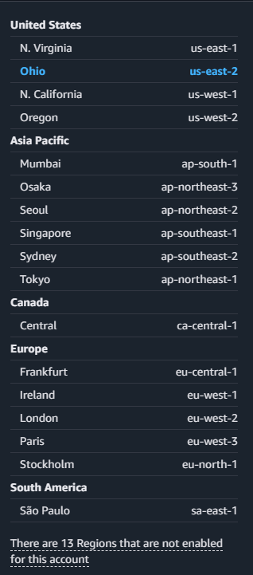

# **OpenVPN Access Server Setup**

## Setup and Host Your Own Free VPN Server on AWS Using Terraform and OpenVPN

In this project, we will demonstrate how to setup and self-host a VPN server on AWS using terraform and OpenVPN Access Server.

??? youtube "Create a Free Self-Hosted VPN Server on AWS using Terraform and OpenVPN"
    <figure markdown="1">
    [](https://www.youtube.com/@opeyemitechpro)
    <figcaption>Create a Free Self-Hosted VPN Server on AWS using Terraform and OpenVPN</figcaption>
    </figure>

    In this video I share How To Create a Free Self-Hosted VPN Server on AWS using Terraform and OpenVPN

## **Quick Start Guide**

??? info "Click here for a quick start guide on setting up the OpenVPN Access Server"

    ## Clone the Repository
    Create a folder on your local machine and clone the repository in the folder

    ``` sh
    git clone https://github.com/opeyemitechpro/OpenVPN-Terraform.git
    ```
    
    ## Initialize the terraform configuration
    From within the cloned directory, initialize the terraform configuration

    ``` tf
    terraform init
    ```

    ## Apply the Terraform Configuration
    ``` tf
    terraform apply
    ```

    - When prompted, enter an AWS region from the list below and respond `yes` to the prompt.  (e.g. `us-west-2`)
    - This will be the AWS region where the VPN server and all resources will be hosted. 

    ### List of accepted AWS regions

    -  us-east-1       =  N. Virginia 
    -  us-east-2       =  Ohio 
    -  us-west-1       =  N. California 
    -  us-west-2       =  Oregon 
    -  af-south-1      =  Cape Town 
    -  ap-east-1       =  Hong Kong 
    -  ap-south-1      =  Mumbai 
    -  ap-southeast-1  =  Singapore 
    -  ap-southeast-2  =  Sydney 
    -  ap-southeast-3  =  Jakarta 
    -  ap-northeast-1  =  Tokyo 
    -  ap-northeast-2  =  Seoul 
    -  ap-northeast-3  =  Osaka 
    -  ca-central-1    =  Canada Central 
    -  eu-central-1    =  Frankfurt 
    -  eu-west-1       =  Ireland 
    -  eu-west-2       =  London 
    -  eu-west-3       =  Paris 
    -  eu-north-1      =  Stockholm 
    -  eu-south-1      =  Milan 
    -  eu-south-2      =  Zurich 
    -  me-south-1      =  Bahrain 
    -  me-central-1    =  UAE 
    -  sa-east-1       =  São Paulo 

    ## Outputs
    At the end of the terraform apply command, the script outputs the following details on the screen:

    - The Public IP address of the VPN Server
    - The instance-ID
    - The name of the keypair created
    - The path where the private key file was saved on your local machine
    - SSH connection string that you can use to the VPN server
    - The OpenVPN profile file that you will use to connect to the VPN server
    - Further steps to launch your VPN connection


    ## Cleanup
    The whole infrastructure can be destroyed by simply using the command:

    ``` tf
    terraform destroy
    ```

    - Enter the AWS region that you entered above and respond `yes` to the prompt.
    - This will terminate the EC2 instance and all resources created and also delete the files that were locally created in the terraform working directory i.e. the *.ovpn user profile and the keypair file that was created earlier 


## Introduction

## Pre-requisites

- AWS account _(free tier account will work)_
- Terraform installed on local machine
- OpenVPN Client installed on local machine

!!! attention "Setup your development environment" 


Step 1 - Clone the Repo using the command below: 

``` sh
git clone https://github.com/opeyemitechpro/OpenVPN-Terraform.git
```

??? I explained the complete Terraform config in details here 
    Terraform config explanation here
    

Step 2 - Open the `terraform.tfvars` file and set the following parameters to suitable values:

[x] - `region_name`: Set this to match the AWS region where you want your VPN server to be located. e.g. if you want your VPN server to be located in Germany, set this to `eu-central-1` (see note below)

??? List of AWS regions explained here
    AWS regions
    

[x] - `key_pair_name`: Create a key-pair in your AWS console in the aws region set above and enter the key-pair name here

[x] - `openvpn_user`: Enter a username for your OpenVPN User profile.

[x] - Other options can be let as is.

Step 3: Open the the folder in your IDE and inintialize the terraform config using the command below:

``` sh
terraform init
```
Fig - init command

Step 4: Run a terraform plan to see list of resources to be created

``` sh
terraform plan
```
Fig - plan command
Step 5: Apply the configuration

``` sh
terraform apply
```

Enter `yes` when prompted and wait for the command to finish.

Fig - apply command, enter yes

The command runs and prints out the Public ip address of your OpenVPN Server and the instance-id.  

Fig - Output instance-id and public-ip address

You can compare and confirm this on your AWS console.

Fig - EC2 Console showing Public-ip address

Connect to your instance using a convenient SSH Client. 
(I will be using MobaXterm for this project as it allows to easily transfer files from the remote client to my local machine. This is a required feature for this project.)

??? note "Donwload MobaXterm from here"
    Click here to download and install MobaXterm SSH Client application on your local machine


[Download MobaXterm Here](https://mobaxterm.mobatek.net)

