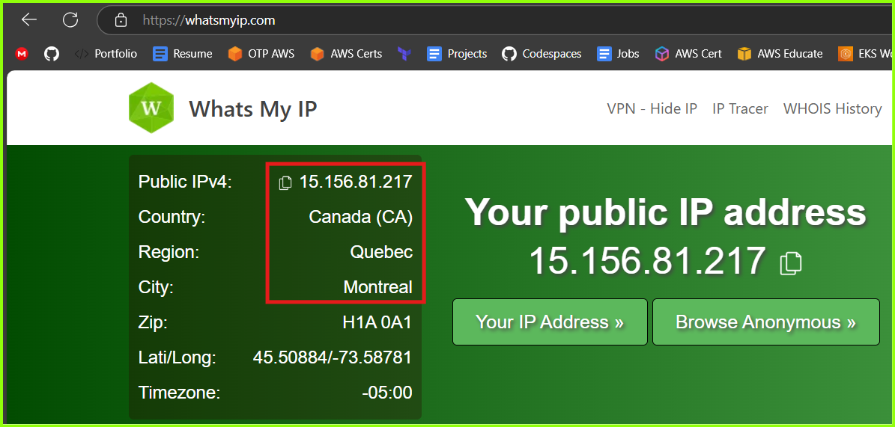
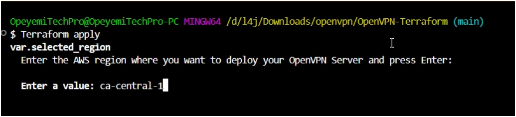
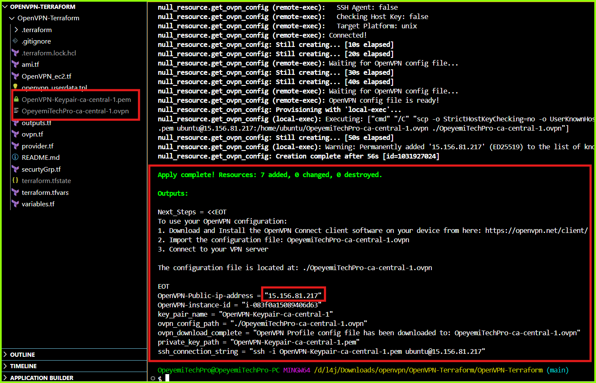
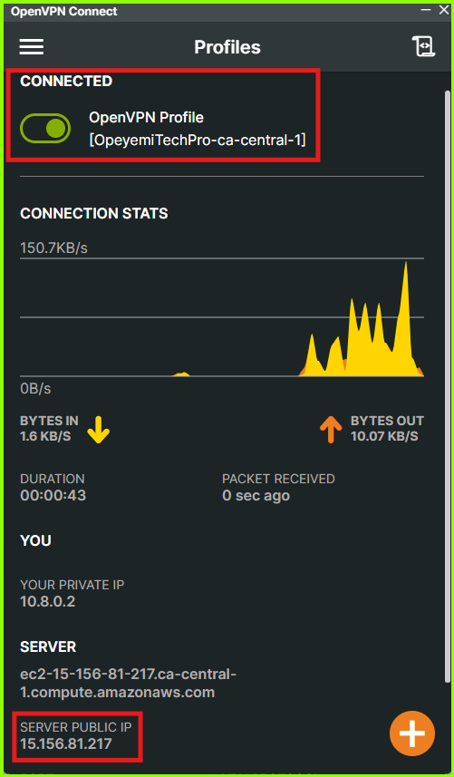

# **OpenVPN Access Server Setup Using Terraform**

## **Setup and Host Your Own Free VPN Server on AWS Using Terraform and OpenVPN**

In this mini-project, I will demonstrate how to setup and self-host a VPN server on AWS using terraform and OpenVPN Access Server.

???+ youtube "Watch the Video - How To Create a Free Self-Hosted VPN Server on AWS using Terraform and OpenVPN" 
    <figure markdown="1">
    [](https://www.youtube.com/@opeyemitechpro){: target="_blank" }
    <!-- <figcaption>Create a Free Self-Hosted VPN Server on AWS using Terraform and OpenVPN</figcaption>  -->
    </figure>
    /// caption
    How to Create a Free Self-Hosted VPN Server on AWS using Terraform and OpenVPN
    ///


## **Introduction**

Setting up a self-hosted VPN server can be a cost-effective and secure solution for personal or organizational needs. This documentation provides a step-by-step guide on using a Terraform configuration script to deploy an OpenVPN server on AWS. With this guide, you'll learn how to configure the script, customize it for your requirements, and launch a fully functional VPN server that ensures your internet traffic remains private and encrypted.

## **Pre-requisites**

- [x] AWS account _(free tier account will work)_
- [x] Terraform installed on local machine
- [x] OpenVPN Client installed on local machine _(download from [here](https://openvpn.net/client/){: target="_blank" })_
- [x] Your AWS access key ID and secret access key _(learn how to get your AWS access keys [here](https://docs.aws.amazon.com/cli/latest/userguide/cli-authentication-user.html){: target="_blank" })_
- [x] AWS CLI installed and configured with your AWS access key ID and Secret access keys _(learn more about AWS CLI [here](https://docs.aws.amazon.com/cli/latest/userguide/getting-started-quickstart.html){: target="_blank" })_ 
- [x] The OpenVPN-Terraform Setup Script _(click the button below)_


[OpenVPN-Terraform Source Code :simple-github:](https://github.com/opeyemitechpro/OpenVPN-Terraform-Setup){: target="_blank" .md-button .md-button--primary}


## **How the Terraform Config Script works**

??? info "Click here to see details of how the OpenVPN Terraform config works under the hood"

    [OpenVPN-Terraform Source Code :simple-github:](https://github.com/opeyemitechpro/OpenVPN-Terraform-Setup){: target="_blank" .md-button}
        
    Each of the files in  this terraform configuration module is explained below:

    ??? tip "The `ami.tf` file"
        
        ???+ code-file "ami.tf"
            
            ``` tf hl_lines="6-9 11-14 16"
            # Select latest Ubuntu 22.04 ami 

            data "aws_ami" "ubuntu" {
            most_recent = true

            filter {
                name   = "name"
                values = ["ubuntu/images/hvm-ssd/ubuntu-jammy-22.04-amd64-server-*"]
            } # (1)

            filter {
                name   = "virtualization-type"
                values = ["hvm"]
            } # (2)

            owners = ["099720109477"]  # Canonical's AWS account ID
            } # (3)
            ```

            1.  Lines 6-9 filters the name of the ami "ubuntu/images/hvm-ssd/ubuntu-jammy-22.04-amd64-server-*"
            2.  Lines 11-14 filters the virtualization type of the ami
            3.  Line 16 filters the AWS account ID of the ami publisher - Canonical
        
        This `ami.tf` is used to find the latest Ubuntu 22.04 AMI (Amazon Machine Image) from the AWS ami Catalog. 
        
        - It creates a data source named "ubuntu" that searches for AMIs with these criteria:
        
            - Uses most_recent = true to get the latest version

            - Filters for Ubuntu 22.04 (Jammy Jellyfish) images using the name pattern

            - Ensures it's using HVM (Hardware Virtual Machine) virtualization

            - Only looks for images owned by Canonical (Ubuntu's publisher) using their AWS account ID (099720109477)

        This prevents hardcoding a specific AMI ID into the script, which could become outdated. The AMI ID is then referenced elsewhere in the Terraform code using `data.aws_ami.ubuntu.id`

    ??? tip "The `OpenVPN_ec2.tf` file"

        ???+ code-file "OpenVPN_ec2.tf" hl_lines="1-24"
            
            ``` tf 
            resource "aws_instance" "OpenVPN_Server" {
            ami                     = data.aws_ami.ubuntu.id
            instance_type           = var.OpenVPN_instance_type
            vpc_security_group_ids  = [ aws_security_group.openvpn_SG.id ]
            user_data               = templatefile("./openvpn_userdata.tpl", {openvpn_user = local.openvpn_user})
            key_name                = aws_key_pair.key_pair.key_name

            root_block_device {
                volume_size           = 8
            }

            # Set the metadata service to allow IMDSv2
            metadata_options {
                http_tokens                 = "optional"    # Allows IMDSv1 and IMDSv2
                http_put_response_hop_limit = 1      # Default hop limit for the PUT request
                http_endpoint               = "enabled"     # Enable metadata service
            }

            tags = {
                Name = "${var.project_name}_Server"
                Region    = var.selected_region
                KeyPair   = local.key_pair_name
                Project   = var.project_name
            }

            }

            locals {
            # Create key name with OpenVPN-Keypair prefix and region
            key_pair_name = "OpenVPN-Keypair-${var.selected_region}"

            # Create Profile name for the OpenVPN User
            openvpn_user = "OpeyemiTechPro-${var.selected_region}"

            # Display formatted region information
            region_display = join("\n", [for region, location in var.aws_regions : format("%s = %s", region, location)])

            }


            # Generate a private key
            resource "tls_private_key" "key_pair" {
            algorithm = "RSA"
            rsa_bits  = 2048
            }

            # Create key pair in AWS
            resource "aws_key_pair" "key_pair" {
            key_name   = local.key_pair_name
            public_key = tls_private_key.key_pair.public_key_openssh

            # tag the key pair
            tags = {
                Name        = local.key_pair_name
                Region      = var.selected_region
                Project     = var.project_name
                CreatedBy   = "Terraform"
            }
            }

            # Save private key locally
            resource "local_file" "private_key" {
            content         = tls_private_key.key_pair.private_key_pem
            filename        = "${local.key_pair_name}.pem"
            file_permission = "0400"
            }


            # Create a null resource to display available regions
            resource "null_resource" "region_display" {
            triggers = {
                always_run = timestamp()
            }

            provisioner "local-exec" {
                command = <<-EOT
                echo "Available AWS Regions:"
                echo "${local.region_display}"
                echo "\nSelected Region: ${var.selected_region} (${var.aws_regions[var.selected_region]})"
                EOT
            }
            }
            ```


        This is the main config file that sets up the OpenVPN server infrastructure.

        - It reates an EC2 instance for the OpenVPN server with the specified configurations (using Ubuntu AMI selected above)

        - Sets up a key pair for SSH access

        - Configures the instance metadata options so it can be queried by the user_data script

        - Creates and saves an RSA private key locally

        - Includes tags for resource management

        - Sets the connection profile name for the VPN server

        - Displays available AWS regions through a null resource and determines the selected region during execution


        ==Each code section is explained breifly below:==

        ==**`aws_instance` Resource**==  
        This resource defines the EC2 instance for the OpenVPN server.  

        - **`ami`**: Uses the ID of a specific Ubuntu AMI fetched via a data source.  
        - **`instance_type`**: Sets the EC2 instance type, determined by a variable (`var.OpenVPN_instance_type`).  
        - **`vpc_security_group_ids`**: Attaches the instance to a specific security group (`aws_security_group.openvpn_SG`).  
        - **`user_data`**: Provides initialization commands for the instance via a template file. Custom variables, such as `openvpn_user`, are passed to the template.  
        - **`key_name`**: Associates the instance with an SSH key pair created earlier.  
        - **`root_block_device`**: Defines the root storage for the instance, setting its size to 8 GB.  
        - **`metadata_options`**: Configures the EC2 metadata service to support both IMDSv1 and IMDSv2 for instance metadata retrieval.  
        - **`tags`**: Adds custom tags to the instance for identification, including project and region details.

        ---

        ==**`locals` Block**==  
        Defines reusable local variables and values for the configuration.  

        - **`key_pair_name`**: Constructs a unique key name with a prefix and region.  
        - **`openvpn_user`**: Creates a unique username for OpenVPN based on the region.  
        - **`region_display`**: Formats a list of available AWS regions for display purposes.  

        ---

        ==**`tls_private_key` Resource**==  
        Generates a 2048-bit RSA private key used to create an AWS key pair.  

        ---

        ==**`aws_key_pair` Resource**==  
        Creates an SSH key pair in AWS.  

        - **`key_name`**: Uses the locally defined key pair name.  
        - **`public_key`**: Sets the public key from the generated private key.  
        - **`tags`**: Adds metadata for the key pair, such as the project name and creation method.  

        ---

        ==**`local_file` Resource**==  
        Stores the generated private key securely on the local machine.  

        - **`content`**: Saves the private key in PEM format.  
        - **`filename`**: Names the file using the key pair name and `.pem` extension.  
        - **`file_permission`**: Sets restrictive permissions (`0400`) for security.  

        ---

        ==**`null_resource` for Region Display**==  
        A helper resource to print available AWS regions to the console.  

        - **`triggers`**: Ensures the resource runs every time by using the current timestamp.  
        - **`provisioner "local-exec"`**: Executes a script that prints available AWS regions and the selected region's details.  

        --- 

        

    ??? tip "The `openvpn_userdata.tpl` file"
        
        ???+ code-file "openvpn_userdata.tpl"
            
            ``` sh 
            #!/bin/bash

            # Bash script to intialize OpenVPN Server

            # Set error trap to exit the script immediately on first error.
            set -e 

            # Log all output to a file for reference 
            exec >> /var/log/setup_script.log 2>&1

            echo "Initializing script..."
            echo
            echo "Updating packages..."
            sudo apt update -y
            echo
            echo "Setting FQDN  & Public IP"
            echo
            FQDN=$(curl -sS http://169.254.169.254/latest/meta-data/public-hostname)
            PUB_IP=$(curl -sS http://169.254.169.254/latest/meta-data/public-ipv4)


            echo "$FQDN"
            echo
            echo "$PUB_IP"
            echo 
            echo "Download installation script"
            echo
            # Check Agristan's repo for full details on installation script options- https://github.com/angristan/openvpn-install

            wget https://raw.githubusercontent.com/angristan/openvpn-install/master/openvpn-install.sh -O openvpn-install.sh
            chmod +x openvpn-install.sh 

            echo "Installing OpenVPN Access Server..."
            echo
            sudo AUTO_INSTALL=y \
                APPROVE_IP=$PUB_IP \
                ENDPOINT=$FQDN \
                CLIENT=${openvpn_user} \
                ./openvpn-install.sh


            echo "Moving User Profile ${openvpn_user}.ovpn to the Ubuntu user home directory..."
            echo
            mv /root/${openvpn_user}.ovpn /home/ubuntu/${openvpn_user}.ovpn

            echo
            echo "Hurray! OpenVPN Installed succesfully"

            # Rename Hostname
            echo "Set hostname as OpenVPN-Server..."
            sudo hostnamectl set-hostname OpenVPN-Server 
            ```


        This is the userdata script that is used to bootstrap the server immediately after it is provisioned by Terraform. It is configured as a template file so that terraform can interpolate the value of `openvpn_user` variable from the variables declared in the config file into the user_data script.

        How it works:
        - Sets bash environment and error handling

        - Captures all the setup process in the log file `/var/log/setup_script.log` so it can be referenced if there are errors 

        - Updates system packages

        - Retrieves instance metadata (FQDN and Public IP) from AWS metadata service which will be needed by the OpenVPN installatin script

        - Downloads the installation script from [Angristan's GitHub repository](https://github.com/angristan/openvpn-install){: target="_blank" }  and sets the executable permissions on the file

        - Runs the installation script configuration automatically without prompts using the "Public IP" and "FQDN" values queried from the instance metadata

        - Sets the Custom client name (from variable ${openvpn_user})

        - Moves the generated client profile (.ovpn file) to Ubuntu user's home directory

        - Sets the system hostname to "OpenVPN-Server"

        ==**Each section of the file is explained below:**==

        ==**Shebang and Setup**==  
        - **`#!/bin/bash`**: Specifies the script should run using the Bash shell.  
        - **`set -e`**: Ensures the script exits immediately if any command fails, preventing incomplete setups.  
        - **`exec >> /var/log/setup_script.log 2>&1`**: Redirects all script output (standard and error) to a log file for debugging and reference.

        ---

        ==**Logging Initialization and Updates**==  
        - **`echo "Initializing script..."`**: Provides a visual indicator that the script has started.  
        - **`sudo apt update -y`**: Updates package lists to ensure the system has the latest available versions.

        ---

        ==**Retrieve and Display Instance Metadata**==  
        - **`FQDN=$(curl -sS http://169.254.169.254/latest/meta-data/public-hostname)`**: Retrieves the Fully Qualified Domain Name (FQDN) of the instance from AWS metadata.  
        - **`PUB_IP=$(curl -sS http://169.254.169.254/latest/meta-data/public-ipv4)`**: Retrieves the public IPv4 address of the instance from AWS metadata.  
        - **`echo "$FQDN"` & `echo "$PUB_IP"`**: Prints the FQDN and public IP to the console for verification.

        ---

        ==**Download and Prepare OpenVPN Installation Script**==  
        - **`wget https://raw.githubusercontent.com/angristan/openvpn-install/master/openvpn-install.sh -O openvpn-install.sh`**: Downloads the OpenVPN installation script from Angristan’s GitHub repository.  
        - **`chmod +x openvpn-install.sh`**: Makes the script executable.

        ---

        ==**Install OpenVPN**==  
        - **`sudo AUTO_INSTALL=y \`**: Enables automatic installation with predefined options.  
        - **`APPROVE_IP=$PUB_IP \`**: Uses the retrieved public IP for OpenVPN configuration.  
        - **`ENDPOINT=$FQDN \`**: Sets the FQDN as the server endpoint.  
        - **`CLIENT=${openvpn_user} \`**: Configures the OpenVPN client with a specified username.  
        - **`./openvpn-install.sh`**: Executes the installation script.

        ---

        ==**Move User Configuration File**==  
        - **`mv /root/${openvpn_user}.ovpn /home/ubuntu/${openvpn_user}.ovpn`**: Moves the generated client profile (`.ovpn` file) to the default user’s home directory for easier access.

        ---

        ==**Post-Installation Messages and Cleanup**==  
        - **`echo "Hurray! OpenVPN Installed successfully"`**: Prints a success message to indicate completion.  
        - **`sudo hostnamectl set-hostname OpenVPN-Server`**: Changes the system’s hostname to "OpenVPN-Server" for easy identification.

        
        
    ??? tip "The `outputs.tf` file"
        
        ???+ code-file "outputs.tf"

            ``` tf 
            # Output values for OpenVPN Server
            output "OpenVPN-Public-ip-address" {
            description = "Public ip address of the OpenVPN server"
            value = aws_instance.OpenVPN_Server.public_ip
            }

            # Display the instance-ID of the OpenVPN Server
            output "OpenVPN-instance-id" {
            description = "Instance id of the OpenVPN Server"
            value = aws_instance.OpenVPN_Server.id
            }

            # Display the instance-ID of the OpenVPN Server
            output "key_pair_name" {
            description = "Name of the created key pair"
            value       = local.key_pair_name
            }

            # Display the path of the private key file
            output "private_key_path" {
            description = "Path to the private key file"
            value       = local_file.private_key.filename
            }

            # Dispaly the ssh connection string
            output "ssh_connection_string" {
            description = "SSH connection string"
            value       = "ssh -i ${local_file.private_key.filename} ubuntu@${aws_instance.OpenVPN_Server.public_ip}"
            }

            # Display the path of the downloaded ovpn profile config file
            output "ovpn_config_path" {
            value       = "./${local.openvpn_user}.ovpn"
            description = "Path to the downloaded OpenVPN config file"
            }

            # Display the path of the downloaded ovpn profile config fil
            output "ovpn_download_complete" {
            value = "OpenVPN Profile config file has been downloaded to: ${local.openvpn_user}.ovpn"
            }

            # Display the next step to access the VPN server
            output "Next_Steps" {
            value = <<-EOT
                To use your OpenVPN configuration:
                1. Download and Install the OpenVPN Connect client software on your device from here: https://openvpn.net/client/
                2. Import the configuration file: ${local.openvpn_user}.ovpn
                3. Connect to your VPN server
                
                The configuration file is located at: ./${local.openvpn_user}.ovpn
            EOT
            }
            ```


        The `outputs.tf` file defines values that will be displayed after Terraform completes its execution. In this specific file, it outputs: [1]

        The following values will be displayed:
        - Public IP address of the OpenVPN server

        - Instance ID of the server

        - Key pair name used for SSH access

        - Details on how to access the VPN server 

        - Path to the private key file that was created

        - SSH connection string (ready to use command for connecting to the server)

        - Location of the downloaded OpenVPN profile (.ovpn file)

        - Next Steps Instructions

        These outputs help users understand where important files are located and what steps to take next after the infrastructure is deployed.


    ??? tip "The `ovpn.tf` file"

        ???+ code-file "ovpn.tf"

            ``` tf 
            
            # Wait for OpenVPN installation and download the profile config file
            resource "null_resource" "get_ovpn_config" {
            depends_on = [aws_instance.OpenVPN_Server]

            # Trigger this resource when instance IP changes
            triggers = {
                instance_ip = aws_instance.OpenVPN_Server.public_ip
                ovpn_file  = "${local.openvpn_user}.ovpn"  # Store filename in triggers
            }

            # Wait for OpenVPN installation to complete and file to be created
            provisioner "remote-exec" {
                inline = [
                "while [ ! -f /home/ubuntu/${local.openvpn_user}.ovpn ]; do sleep 20; echo 'Waiting for OpenVPN config file...'; done",
                "echo 'OpenVPN config file is ready!'"
                ]

                connection {
                type        = "ssh"
                user        = "ubuntu"
                private_key = tls_private_key.key_pair.private_key_pem
                host        = aws_instance.OpenVPN_Server.public_ip
                }
            }

            # Download the OpenVPN profile config file
            provisioner "local-exec" {
                command = "scp -o StrictHostKeyChecking=no -o UserKnownHostsFile=/dev/null -i ${local_file.private_key.filename} ubuntu@${aws_instance.OpenVPN_Server.public_ip}:/home/ubuntu/${local.openvpn_user}.ovpn ./${local.openvpn_user}.ovpn"
            }

            # Clean up the .ovpn file after destroy
            provisioner "local-exec" {
                when    = destroy
                command = "rm -f ./${self.triggers.ovpn_file}"
            }
            }
            ```


        The `ovpn.tf` file manages the retrieval of the OpenVPN configuration file from the remote VPN server and donwloads it in the terraform working directory. The main purpose of this file is to ensure you get the OpenVPN client configuration file automatically downloaded to your local machine once it's ready on the server.

        Here’s a breakdown of each section of this file:

        
        ==**Resource Definition**==
        - **`null_resource "get_ovpn_config"`**: A helper resource used to wait for the OpenVPN configuration file to be generated, then download it locally. This resource doesn't create infrastructure directly but adds automation to the deployment process.

        ---

        ==**Dependency and Trigger Configuration**==
        - **`depends_on = [aws_instance.OpenVPN_Server]`**: Ensures this resource executes only after the OpenVPN server instance is successfully created.
        - **`triggers`**:  
        - **`instance_ip`**: Ensures the resource is re-applied if the public IP of the OpenVPN server changes.  
        - **`ovpn_file`**: Tracks the expected `.ovpn` configuration filename as a trigger, ensuring changes to this filename will trigger re-execution.

        ---

        ==**Remote Execution Provisioner**==
        - **`provisioner "remote-exec"`**: Executes commands on the OpenVPN server to ensure the `.ovpn` configuration file is ready.  
        - **`inline`**: Contains the commands to:
            - **`while [ ! -f /home/ubuntu/... ]; do`**: Polls the server every 20 seconds, checking if the `.ovpn` file exists.  
            - **`echo 'Waiting for OpenVPN config file...'`**: Prints a message during the wait loop.  
            - **`echo 'OpenVPN config file is ready!'`**: Signals the file is available.  
        - **`connection`**: Defines SSH connection details:
            - **`type`**: Specifies SSH as the connection type.  
            - **`user`**: Specifies the user (`ubuntu`) to connect with.  
            - **`private_key`**: Uses the private key generated earlier for authentication.  
            - **`host`**: Specifies the public IP of the OpenVPN server instance.

        ---

        ==**Local Execution Provisioner**==
        - **First `local-exec` block**: Downloads the `.ovpn` file to the local machine.  
        - **`scp`**: Securely copies the file from the OpenVPN server to the local directory.  
        - **Options**:
            - **`-o StrictHostKeyChecking=no`**: Disables host key checking to avoid interactive prompts.  
            - **`-o UserKnownHostsFile=/dev/null`**: Prevents updates to the local known hosts file.  
            - **`-i`**: Specifies the SSH private key for authentication.  

        ---

        ==**Cleanup on Resource Destruction**==
        - **Second `local-exec` block**: Deletes the downloaded `.ovpn` file when the resource is destroyed.  
        - **`when = destroy`**: Ensures the command is only executed during the resource destruction phase.  
        - **`rm -f ./${self.triggers.ovpn_file}`**: Removes the file using the name stored in the triggers.

        ---

        ==**Overall Function**==
        This file ensures that the OpenVPN profile configuration file is created on the server, securely downloads it to the local system, and removes it when no longer needed (when the `terraform destroy` command is run). It integrates waiting, remote command execution, and local file operations seamlessly within the Terraform workflow.

    ??? tip "The `provider.tf` file"

        ???+ code-file "provider.tf"

            ``` tf 
            # 
            terraform {
            required_providers {
                aws = {
                source  = "hashicorp/aws"
                version = "~> 5.0"
                }
                local = {
                source  = "hashicorp/local"
                version = "~> 2.0"
                }
                tls = {
                source  = "hashicorp/tls"
                version = "~> 4.0"
                }
                null = {
                source  = "hashicorp/null"
                version = "~> 3.0"
                }
            }
            required_version = ">= 1.2.0"
            }

            # Configure the AWS Provider
            provider "aws" {
            region = "${var.selected_region}"
            }
            ```


        The file essentially sets up the foundational configuration sources and versions needed for Terraform to interact with AWS and to use other necessary providers for the OpenVPN deployment. 

    ??? tip "The `securityGrp.tf` file"

        ???+ code-file "securityGrp.tf"

            ``` tf 
            # OpenVPN Server Security Group
            resource "aws_security_group" "openvpn_SG" {
            name_prefix = "${var.project_name}_openvpn_SG_"
            description = "OpeyemiTechPro OpenVPN Security Group"

            dynamic "ingress" {
                for_each = var.openvpn_tcp_ports
                content {
                from_port   = ingress.key
                to_port     = ingress.key
                protocol    = "tcp"
                cidr_blocks = ["0.0.0.0/0"]
                description = ingress.value
                }
            }

            dynamic "ingress" {
                for_each = var.openvpn_udp_ports
                content {
                from_port   = ingress.key
                to_port     = ingress.key
                protocol    = "udp"
                cidr_blocks = ["0.0.0.0/0"]
                description = ingress.value
                }
            }  

            egress {
                from_port   = 0
                to_port     = 0
                protocol    = "-1"
                cidr_blocks = ["0.0.0.0/0"]
            }
            }
            ```


        This configures the required security group profile for the OpenVPN server. It opens the required ports for ingress and egress and the neccesary port protocols (tcp and udp).

        ==The sections of the `securityGrp.tf` file are explained breigly below:==
        
        
        ==**Resource Definition**==
        - **`resource "aws_security_group" "openvpn_SG"`**: Creates a security group in AWS to define network access rules for the OpenVPN server.

        ---

        ==**Security Group Naming and Description**==
        - **`name_prefix`**: Sets a prefix for the security group name, combining the project name (`var.project_name`) with `_openvpn_SG_`. AWS appends a unique identifier to the prefix.
        - **`description`**: Provides a description for the security group, indicating its purpose (OpenVPN security).

        ---

        ==**Dynamic Ingress Rules for TCP Ports**==
        - **`dynamic "ingress"` (first block)**:
        - **`for_each = var.openvpn_tcp_ports`**: Iterates over a map of TCP ports and descriptions provided in the variable `var.openvpn_tcp_ports`.
        - **`content {}`**: Defines the content of each rule:
            - **`from_port` and `to_port`**: Sets the port range for the rule, using the key from the iteration (`ingress.key`).
            - **`protocol = "tcp"`**: Specifies that the rule applies to TCP traffic.
            - **`cidr_blocks = ["0.0.0.0/0"]`**: Allows traffic from all IP addresses.
            - **`description = ingress.value`**: Provides a description for the rule, using the value from the iteration.

        ---

        ==**Dynamic Ingress Rules for UDP Ports**==
        - **`dynamic "ingress"` (second block)**:
        - Similar to the first block, but applies to **UDP traffic**.
        - Iterates over the variable `var.openvpn_udp_ports`, which contains a map of UDP ports and their descriptions.

        ---

        ==**Egress Rules**==
        - **`egress` block**:
        - **`from_port = 0` and `to_port = 0`**: Allows all outbound traffic across all port ranges.
        - **`protocol = "-1"`**: Applies the rule to all protocols.
        - **`cidr_blocks = ["0.0.0.0/0"]`**: Allows traffic to all IP addresses.

        ---

        ==**Overall Function**==
        This security group:
        1. Dynamically creates ingress (inbound) rules for both TCP and UDP traffic based on user-defined ports and descriptions (`var.openvpn_tcp_ports` and `var.openvpn_udp_ports`).
        2. Configures unrestricted egress (outbound) traffic to allow the OpenVPN server to communicate with any destination.
        3. Ensures that all rules are flexible and easy to manage via Terraform variables, making it adaptable for different use cases.


    ??? tip "The `terraform.tfvars` file"

        ???+ code-file "terraform.tfvars"

            ``` tf 
            # Project Details
            project_name = "Opeyemi_OpenVPN_YT"


            # Variables for OpenVPN Server
            OpenVPN_instance_type = "t2.micro"

            # OpenVPN Server port Details
            openvpn_tcp_ports = {
            "22" = "SSH Access"
            "80"  = "HTTP Access"
            "443" = "HTTPS Access" 
            "943" = "OpenVPN Management Port"
            }

            openvpn_udp_ports = {
            "1194" = "OpenVPN udp Port"
            }
            ```


        Here, values are assigned to all the declared variables in the config script.  You can freely change any values here to customize the script for your own purpose

    ??? tip "The `variables.tf` file"

        ???+ code-file "variables.tf"

            ``` tf 
            
            variable "project_name" {
            description = "Title of the Project"
            type        = string
            }

            variable "OpenVPN_instance_type" {
            description = "The type of EC2 instance to launch for the OpenVPN Server"
            type        = string
            }
            variable "openvpn_tcp_ports" {
            type = map(string)
            description = "Map of OpenVPN ports to their descriptions"
            }

            variable "openvpn_udp_ports" {
            type = map(string)
            description = "Map of OpenVPN UDP ports to their descriptions"
            }

            variable "aws_regions" {
            type = map(string)
            default = {
                "us-east-1"      = "N. Virginia"
                "us-east-2"      = "Ohio"
                "us-west-1"      = "N. California"
                "us-west-2"      = "Oregon"
                "af-south-1"     = "Cape Town"
                "ap-east-1"      = "Hong Kong"
                "ap-south-1"     = "Mumbai"
                "ap-southeast-1" = "Singapore"
                "ap-southeast-2" = "Sydney"
                "ap-southeast-3" = "Jakarta"
                "ap-northeast-1" = "Tokyo"
                "ap-northeast-2" = "Seoul"
                "ap-northeast-3" = "Osaka"
                "ca-central-1"   = "Canada Central"
                "ca-west-1"      = "Calgary"
                "cn-north-1"     = "Beijing"
                "cn-northwest-1" = "Ningxia"
                "eu-central-1"   = "Frankfurt"
                "eu-central-2"   = "Zurich"
                "eu-west-1"      = "Ireland"
                "eu-west-2"      = "London"
                "eu-west-3"      = "Paris"
                "eu-north-1"     = "Stockholm"
                "eu-south-1"     = "Milan"
                "eu-south-2"     = "Spain"
                "me-south-1"     = "Bahrain"
                "me-central-1"   = "UAE"
                "sa-east-1"      = "São Paulo"
                "il-central-1"   = "Tel Aviv"
            }
            }

            variable "selected_region" {
            type        = string
            description = "Enter the AWS region where you want to deploy your OpenVPN Server and press Enter:"

            validation {
                condition     = can(regex("^(eu|us|ap|ca|sa|me|af|il|cn)-(central|west|east|north|south|southeast|northeast|northwest)-[1-3]$", var.selected_region))
                error_message = "Please select a valid AWS region from the provided list."
            }
            }
            ```

        The `variables.tf` file is used to define variables that make the configuration more dynamic and reusable. By abstracting values into variables, I can easily customize the infrastructure without directly modifying the configuration files.


## **Setting the script options**

The script allows you to set some options based on your use case. These are the available options you can set:

- [x] ==project_name== - This is used for labelling purposes only. It is appended to the resource tags
- [x]  ==OpenVPN_instance_type== - This has been set to `t2-micro` so the setup remains within the AWS free-tier plan.  You can change this to any suitable instance type but a t2-micro will server in most situations
- [x] ==openvpn_user== - This is the username used to create the `*.ovpn` profile file on the VPN server. The profile name is displayed when you connect through the OpenVPN client. It is currently set to append the selected AWS region so you can easily know which region you are connected to.
- [x] ==selected_region== - this option is set at runtime and it is required for the script to run. Here you select the AWS region where you want your server to be hosted.  The region you select will determine where your VPN traffic is routed through. For example, if you select `ca-central-1`, your VPN traffic will be routed through the AWS Canada Central IP address and as such your public IP address will read "Quebec, Montreal, Canada" 



The list of acceptable AWS regions are shown [here](https://opeyemitech.pro/my-projects/terraform_projects/openvpn_access_server/#list-of-accepted-aws-regions)

## **Running the script**
Follow the ==**"Quick Start Guide"**== below to provision and configure your OpenVPN server and to connect to your new VPN network.

## **Quick Start Guide**

??? info "Click here for a quick start guide on setting up the OpenVPN Access Server"

    ### Clone the Repository
    Create a folder on your local machine and clone the repository in the folder

    ``` sh
    git clone https://github.com/opeyemitechpro/OpenVPN-Terraform.git
    ```
    
    ### Initialize the terraform configuration
    From within the cloned directory, initialize the terraform configuration

    ``` sh
    terraform init
    ```

    

    ### Apply the Terraform Configuration

    ``` sh
    terraform apply
    ```
    
    - When prompted, enter an AWS region from the list below and respond `yes` to the prompt.  (e.g. `us-west-2`)
    - This will be the AWS region where the VPN server and all resources will be hosted. 

    
    
    
    #### ==List of accepted AWS regions==

    -  us-east-1       =  N. Virginia 
    -  us-east-2       =  Ohio 
    -  us-west-1       =  N. California 
    -  us-west-2       =  Oregon 
    -  af-south-1      =  Cape Town 
    -  ap-east-1       =  Hong Kong 
    -  ap-south-1      =  Mumbai 
    -  ap-southeast-1  =  Singapore 
    -  ap-southeast-2  =  Sydney 
    -  ap-southeast-3  =  Jakarta 
    -  ap-northeast-1  =  Tokyo 
    -  ap-northeast-2  =  Seoul 
    -  ap-northeast-3  =  Osaka 
    -  ca-central-1    =  Canada Central 
    -  eu-central-1    =  Frankfurt 
    -  eu-west-1       =  Ireland 
    -  eu-west-2       =  London 
    -  eu-west-3       =  Paris 
    -  eu-north-1      =  Stockholm 
    -  eu-south-1      =  Milan 
    -  eu-south-2      =  Zurich 
    -  me-south-1      =  Bahrain 
    -  me-central-1    =  UAE 
    -  sa-east-1       =  São Paulo 

    ### Outputs
    At the end of the terraform apply command, the script outputs the following details on the screen:

    - The Public IP address of the VPN Server
    - The instance-ID
    - The name of the keypair created
    - The path where the private key file was saved on your local machine
    - SSH connection string that you can use to the VPN server
    - The OpenVPN profile file that you will use to ssh into the VPN server
    - Further steps to launch your VPN connection

    

    **Showing the OpenVPN server on the AWS EC2 Console**
    

    ### Connect to your VPN
    - Download and install [OpenVPN Connect client](https://openvpn.net/client/){: target="_blank" } on your local machine
    - Import the `*.ovpn` file into the OpenVPN cient appllication
    - Connect to your VPN network

    

    ### Testing your VPN Connection
    One very simple way to check if you are actually connected to your new VPN network is to open your browser and check your public IP address. You can use websites like [whatsmyip.com](hhtps://whatsmyip.com) or simply search "what is my ip address" on Google to check your public IP address.  

    
    
    When you are connected to your VPN server, your internet traffic will be routed through your VPN server and as such, only your VPN server IP address will be seen publicly, your local ISP assigned ip address will be hidden from the internet. 

    ### Cleanup
    The whole infrastructure can be destroyed by simply using the command:

    ``` sh
    terraform destroy
    ```

    - Enter the AWS region that you entered above and respond `yes` to the prompt.
    - This will terminate the EC2 instance and delete all resources created and also delete the files that were locally created in the terraform working directory i.e. the *.ovpn user profile and the keypair file that was created earlier 

    


## **Use Cases**
This self-hosted OpenVPN solution offers flexibility, control, and enhanced security compared to commercial VPN services. Here are some possible use cases:  

**1. Secure Remote Access**
- **Corporate Network Access**: Allow employees to securely connect to on-premises resources or internal systems.  
- **Remote Development**: Enable developers to work on private servers or cloud environments without exposing them to the public internet.  

**2. Privacy and Anonymity**
- **Encrypt Internet Traffic**: Protect personal or organizational internet traffic, especially when using public Wi-Fi.  
- **Location Masking**: Access the internet as if from a specific location to bypass geolocation restrictions.  

**3. Secure Inter-Office Communication**
- **Branch Office Connectivity**: Connect multiple office locations securely over a shared network.  
- **IoT Devices**: Secure communication for IoT devices spread across different sites.  

**4. Personal Use**
- **Ad-Free Browsing**: Avoid invasive tracking and ads by routing traffic through your onw self-hosted VPN server.  
- **Bypass ISP Throttling**: Prevent internet service providers from throttling bandwidth for specific services.  

**5. Development and Testing**
- **Environment Testing**: Simulate network environments for application development and QA testing.  
- **Access Restricted APIs**: Connect securely to APIs or other restricted services during development.  

**6. Secure Cloud Resources**
- **Private Cloud Access**: Connect securely to AWS resources without exposing them to the public internet.  
- **DevOps Pipelines**: Ensure secure deployment pipelines that require private network connectivity.  

**7. Enhanced Security**
- **Multi-Layered Security**: Combine a self-hosted VPN with firewalls or IDS/IPS systems to add another layer of protection.  
- **Self-Controlled Data**: Prevent third-party logging or tracking of your internet activity.  

**8. Education and Research**
- **Bypass Censorship**: Enable access to academic resources or restricted sites in regions with strict censorship.  
- **Research Anonymity**: Conduct secure and private research online.  

**9. Cost Efficiency**
- **Avoiding Commercial VPN Costs**: Reduce long-term expenses for secure connections, especially for teams or organizations.  
- **No User Limits**: Create a solution tailored to your usage, avoiding per-user or bandwidth fees common with commercial VPNs.  

**10. Gaming and Media**
- **LAN Gaming**: Create a virtual local area network for multiplayer gaming.  
- **Bypass Regional Blocks**: Access region-restricted content like streaming services.  

By usign this solution to host your own VPN, you gain complete control over configuration, logs, and data flow, making it an excellent choice for your specific use case.

## **Conclusion**

Setting up a self-hosted VPN server using this Terraform configuration script is a straightforward and efficient way to enhance your network security and maintain control over your data. By following this documentation, you can deploy a robust OpenVPN server on AWS, customize it to your needs, and ensure private and secure internet access. This guide aims to empower you with the knowledge and tools to manage your own VPN server effectively. For any troubleshooting or further customization, explore the Terraform and OpenVPN documentation for advanced insights and solutions. 